Μηχανική Μάθηση με R
================
Ευαγγελιδάκης Λέανδρος

<h1>

ΜΕΡΟΣ Ι

</h1>

# Άσκηση 1

Θέλουμε να μελετήσουμε τους παράγοντες που προκαλούν το διαβήτη
Δημιουργείστε το κατάλληλο μοντέλο πρόβλεψης και κάντε ανάλυση
προς κάθε κατεύθυνση, ποιες μεταβλητές είναι σημαντικές? ερμηνεύστε τα
αποτελέσματα Να προβλέψετε τα αποτελέσματα για τα επόμενα 4 άτομα.

    ##   npreg glu bp bmi skin  ped age
    ## 1     5 140 76  70   20 0.60  40
    ## 2     1  80 70  25   45 0.56  25
    ## 3     8 120 60  27   30 0.50  44
    ## 4     2  91 50  68   23 0.70  34

<p style="text-align:center;font-size:22px">

<u>Λύση</u>

</p>

Τα δεδομένα περιέχονται στο πακέτο δεδομένων MASS της R και αφορούν
διαγνώσεις για διαβήτη σε γυναίκες απο την Ινδία, άνω των 21 ετών,
που διαμένουν στην Αμερική.

Παρακάτω βλέπουμε κάποια βασικά στατιστικά για τα δεδομένα.

``` r
data <- Pima.te
summary(data)
```

    ##      npreg             glu              bp              skin      
    ##  Min.   : 0.000   Min.   : 65.0   Min.   : 24.00   Min.   : 7.00  
    ##  1st Qu.: 1.000   1st Qu.: 96.0   1st Qu.: 64.00   1st Qu.:22.00  
    ##  Median : 2.000   Median :112.0   Median : 72.00   Median :29.00  
    ##  Mean   : 3.485   Mean   :119.3   Mean   : 71.65   Mean   :29.16  
    ##  3rd Qu.: 5.000   3rd Qu.:136.2   3rd Qu.: 80.00   3rd Qu.:36.00  
    ##  Max.   :17.000   Max.   :197.0   Max.   :110.00   Max.   :63.00  
    ##       bmi             ped              age         type    
    ##  Min.   :19.40   Min.   :0.0850   Min.   :21.00   No :223  
    ##  1st Qu.:28.18   1st Qu.:0.2660   1st Qu.:23.00   Yes:109  
    ##  Median :32.90   Median :0.4400   Median :27.00            
    ##  Mean   :33.24   Mean   :0.5284   Mean   :31.32            
    ##  3rd Qu.:37.20   3rd Qu.:0.6793   3rd Qu.:37.00            
    ##  Max.   :67.10   Max.   :2.4200   Max.   :81.00

Στη συνέχεια κατασκευάζουμε θηκογράμματα για κάθε χαρακτηριστικό σε
σχέση με τη διάγνωση(type).

``` r
p1<-ggplot(data=data, aes(x=type, y=npreg)) +geom_boxplot()
p2<-ggplot(data=data, aes(x=type, y= glu )) +geom_boxplot()
p3<-ggplot(data=data, aes(x=type, y= skin)) +geom_boxplot()
p4<-ggplot(data=data, aes(x=type, y= bp )) +geom_boxplot()
p5<-ggplot(data=data, aes(x=type, y=  bmi )) +geom_boxplot()
p6<-ggplot(data=data, aes(x=type, y= ped )) +geom_boxplot()
p7<-ggplot(data=data, aes(x=type, y= age  )) +geom_boxplot()

grid.arrange(p1, p2,p3,p4,p5,p6,p7, ncol=3)
```

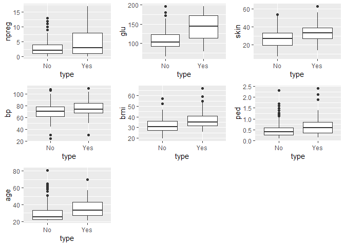<!-- -->

Παρατηρούμε τις εμφανείς διαφορές στα διαγράμματα που αφορούν την ηλικία
(age), τα επίπεδα γλυκόζης (glu) και τον αριθμό των τοκετών (npreg) που
είχαν οι γυναίκες που εξετάστηκαν. Αυτό ίσως είναι μια πρώτη ένδειξη
ότι οι μεταβλητές σχετίζονται με το διαβήτη.

Επιπλέον παραθέτουμε τα ιστογράμματα για κάθε μεταβλητή. Όπως φαίνεται
ορισμένες παρουσιάζουν κάποια ομοιομοφία στην κατανομή τους
(skin,bp,bmi), ενώ άλλες είναι εμφανώς μή-ομοιόμορφες (nreg,ped,age)

``` r
p1<-ggplot(data=data, aes(npreg)) +geom_histogram(binwidth = 1)
p2<-ggplot(data=data, aes(glu )) +geom_histogram(binwidth = 1)
p3<-ggplot(data=data, aes(skin)) +geom_histogram(binwidth = 1)
p4<-ggplot(data=data, aes(bp ))  +geom_histogram(binwidth = 1)
p5<-ggplot(data=data, aes(bmi )) +geom_histogram(binwidth = 1)
p6<-ggplot(data=data, aes(ped ))  +geom_histogram(binwidth = 1)
p7<-ggplot(data=data, aes(age  )) +geom_histogram(binwidth = 1)
p8<-ggplot(data=data, aes(type)) +geom_histogram(stat='count')
```

    ## Warning: Ignoring unknown parameters: binwidth, bins, pad

``` r
grid.arrange(p1, p2,p3,p4,p5,p6,p7,p8, ncol=3)
```

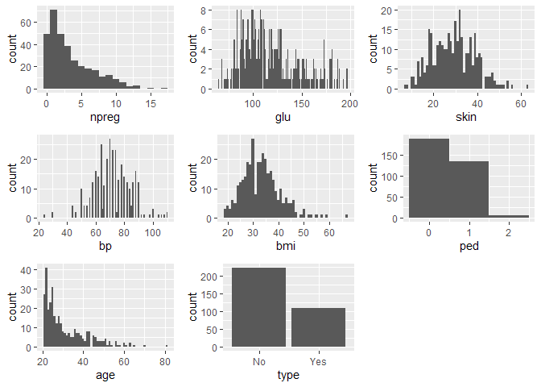<!-- -->

Στη συνέχεια υπολογίζουμε το συντελεστή συχέτισης του Pearson μεταξύ των
μεταβλητών.

``` r
corr<-round(cor(data[,-8]),4)
corr
```

    ##         npreg    glu     bp   skin     bmi    ped    age
    ## npreg  1.0000 0.0955 0.1795 0.0852 -0.0159 0.0755 0.6674
    ## glu    0.0955 1.0000 0.1947 0.2352  0.2742 0.2352 0.2346
    ## bp     0.1795 0.1947 1.0000 0.2048  0.3382 0.0312 0.3249
    ## skin   0.0852 0.2352 0.2048 1.0000  0.6585 0.1369 0.0946
    ## bmi   -0.0159 0.2742 0.3382 0.6585  1.0000 0.1267 0.0473
    ## ped    0.0755 0.2352 0.0312 0.1369  0.1267 1.0000 0.1530
    ## age    0.6674 0.2346 0.3249 0.0946  0.0473 0.1530 1.0000

Και γραφικά

``` r
ggcorrplot(corr, method= "square",type= "lower",show.legend= TRUE,legend.title  = "Correlation",show.diag= TRUE,hc.order= TRUE,colors = c("blue", "white", "red"),lab= TRUE)
```

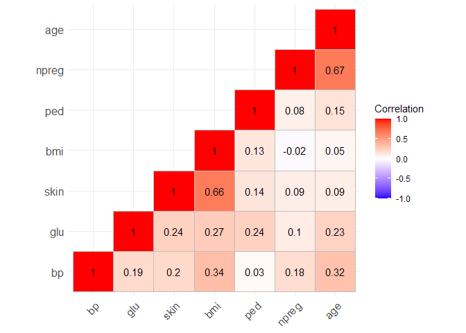<!-- -->

Οι υψηλότερες συσχετίσεις προέρχονται από τον αριθμό τον τοκετών (npreg)
με την ηλικία (age) σε ποσοστό 66.74% και από τον δείκτη βάρους σώματος
(bmi) με το πάχος του δέρματος (skin) σε ποσοστό 65.84%.

<b>Λογιστική Παλινδρόμηση</b>

Αρχικά χρησιμοποιούμε λογιστική παλινδρόμηση για την πρόβλεψη του
διαβήτη. Πρώτα χωρίζουμε τα δεδομένα σε σύνολα εκπαίδευσης και
ελέγχου σε ποσοστό 80-20 χρησιμοποιώντας όλες τις μεταβλητές. Η
επιλογή γίνεται παίρνοντας τυχαίο δείγμα από το σύνολο δεδομένων.

``` r
set.seed(777)
sample_values = sample(332,332*0.8,replace = FALSE)
train = data[sample_values, ]
test = data[-sample_values, ]

log_regr <- glm(type ~.,data = train, family = "binomial")
summary(log_regr)
```

    ## 
    ## Call:
    ## glm(formula = type ~ ., family = "binomial", data = train)
    ## 
    ## Deviance Residuals: 
    ##     Min       1Q   Median       3Q      Max  
    ## -2.8396  -0.6539  -0.3698   0.6225   2.2011  
    ## 
    ## Coefficients:
    ##              Estimate Std. Error z value Pr(>|z|)    
    ## (Intercept) -9.310947   1.350142  -6.896 5.34e-12 ***
    ## npreg        0.124667   0.065662   1.899   0.0576 .  
    ## glu          0.039583   0.006316   6.267 3.67e-10 ***
    ## bp          -0.011224   0.013560  -0.828   0.4078    
    ## skin         0.015362   0.022391   0.686   0.4927    
    ## bmi          0.075554   0.030126   2.508   0.0121 *  
    ## ped          0.800166   0.488366   1.638   0.1013    
    ## age          0.018649   0.020539   0.908   0.3639    
    ## ---
    ## Signif. codes:  0 '***' 0.001 '**' 0.01 '*' 0.05 '.' 0.1 ' ' 1
    ## 
    ## (Dispersion parameter for binomial family taken to be 1)
    ## 
    ##     Null deviance: 336.89  on 264  degrees of freedom
    ## Residual deviance: 228.12  on 257  degrees of freedom
    ## AIC: 244.12
    ## 
    ## Number of Fisher Scoring iterations: 5

Όπως φαίνεται παραπάνω, οι μεταβλητές bp,skin και age δεν φαίνεται να
είναι στατιστικά σημαντικές,για το συγκεκριμένο μοντέλο, καθώς
παρουσιάζουν υψηλό P-value. Αντίθετα οι μεταβλητές npreg και glu
και bmi έχουν σχετικά μικρό p-value και αυτό είναι μια ένδειξη ότι
έχουν στατιστικά σημαντική επίδραση στο εν λόγω μοντέλο. Επιπλέον
χρησιμοποιούμε την εντολή varImp() από το πακέτο caret που υπολογίζει
μεμονωμένα τη σημαντικότητα των μεταβλητών του μοντέλου.

``` r
varImp(log_regr)
```

    ##         Overall
    ## npreg 1.8986300
    ## glu   6.2673248
    ## bp    0.8277491
    ## skin  0.6860725
    ## bmi   2.5079741
    ## ped   1.6384558
    ## age   0.9080016

Βλέπουμε ότι η μεταβλητή glu έχει την πιο σημαντική επίδραση στο μοντέλο
ακολουθούμενη από τη μεταβλητή bmi και npreg.

Παρακάτω υπολογίζουμε τον πίνακα σύγχυσης εφαρμόζοντας το μοντέλο στα
δεδομένα εκπαίδευσης και ελέγχου. Επιλέγουμε τις προβλέψεις όπου το
log-ratio \> 0.6.

``` r
print('Train set')
```

    ## [1] "Train set"

``` r
predtrain <- predict(log_regr,data = train, type = "response")
table_train<-table(Actual = train$type, Predicted = predtrain>0.6)
table_train
```

    ##       Predicted
    ## Actual FALSE TRUE
    ##    No    167   10
    ##    Yes    41   47

``` r
print('Test set')
```

    ## [1] "Test set"

``` r
predtest <- predict(log_regr, newdata = test, type = "response")
table_test<-table(Actual = test$type, Predicted = predtest>0.6)
table_test
```

    ##       Predicted
    ## Actual FALSE TRUE
    ##    No     43    3
    ##    Yes    10   11

``` r
print(paste("Accuracy on test set: ",sum(diag(table_test))/sum(table_test)))
```

    ## [1] "Accuracy on test set:  0.805970149253731"

Το μοντέλο παρουσιάζει ακρίβεια 80.60%

Στη συνέχεια κάνουμε την ίδια διαδικασία χρησιμοποιώντας μόνο τις
μεταβλητές glu,bmi,npreg

``` r
log_regr2 <- glm(type ~ glu+bmi+npreg,data = train, family = "binomial")
summary(log_regr2)
```

    ## 
    ## Call:
    ## glm(formula = type ~ glu + bmi + npreg, family = "binomial", 
    ##     data = train)
    ## 
    ## Deviance Residuals: 
    ##     Min       1Q   Median       3Q      Max  
    ## -2.3164  -0.6387  -0.3860   0.6199   2.2599  
    ## 
    ## Coefficients:
    ##              Estimate Std. Error z value Pr(>|z|)    
    ## (Intercept) -9.157429   1.153952  -7.936 2.09e-15 ***
    ## glu          0.041318   0.006059   6.819 9.16e-12 ***
    ## bmi          0.080857   0.023446   3.449 0.000563 ***
    ## npreg        0.165589   0.049641   3.336 0.000851 ***
    ## ---
    ## Signif. codes:  0 '***' 0.001 '**' 0.01 '*' 0.05 '.' 0.1 ' ' 1
    ## 
    ## (Dispersion parameter for binomial family taken to be 1)
    ## 
    ##     Null deviance: 336.89  on 264  degrees of freedom
    ## Residual deviance: 232.84  on 261  degrees of freedom
    ## AIC: 240.84
    ## 
    ## Number of Fisher Scoring iterations: 5

``` r
print('Train set')
```

    ## [1] "Train set"

``` r
predtrain <- predict(log_regr2,data = train, type = "response")
table_train<-table(Actual = train$type, Predicted = predtrain>0.6)
table_train
```

    ##       Predicted
    ## Actual FALSE TRUE
    ##    No    165   12
    ##    Yes    40   48

``` r
print('Test set')
```

    ## [1] "Test set"

``` r
predtest <- predict(log_regr2, newdata = test, type = "response")
table_test<-table(Actual = test$type, Predicted = predtest>0.6)
table_test
```

    ##       Predicted
    ## Actual FALSE TRUE
    ##    No     44    2
    ##    Yes    10   11

``` r
accuracy<-sum(diag(table_test))/sum(table_test)
print(paste("Accuracy on test set: ",accuracy))
```

    ## [1] "Accuracy on test set:  0.82089552238806"

To νέο μοντέλο έχει ακρίβεια 82.1%, ελαφρώς μεγαλύτερη από το αρχικό και
παρουσιάζει μικρότερο AIC.

<b>k-NN</b>

Πρώτα θα υπολογίσουμε το βέλτιστο πλήθος γειτόνων k χρησιμοποιώντς
grid-search για k=2,…,30 και υπολογισμό ακρίβειας με βάση 10-fold
cross-validation.Για το σκοπό αυτό χρησιμοποιούμε τη βιβλιοθήκη caret.

``` r
knn_model = train(type~., data=train, method="knn",trControl=trainControl(method="cv"),
                  tuneGrid=expand.grid(.k=seq(2,20, by=1)))
knn_model
```

    ## k-Nearest Neighbors 
    ## 
    ## 265 samples
    ##   7 predictor
    ##   2 classes: 'No', 'Yes' 
    ## 
    ## No pre-processing
    ## Resampling: Cross-Validated (10 fold) 
    ## Summary of sample sizes: 238, 238, 238, 239, 239, 239, ... 
    ## Resampling results across tuning parameters:
    ## 
    ##   k   Accuracy   Kappa    
    ##    2  0.6866097  0.3098016
    ##    3  0.7324786  0.4020067
    ##    4  0.7508547  0.4308036
    ##    5  0.7544160  0.4418735
    ##    6  0.7320513  0.3767644
    ##    7  0.7739316  0.4710784
    ##    8  0.7509972  0.4184260
    ##    9  0.7622507  0.4418604
    ##   10  0.7549858  0.4248925
    ##   11  0.7659544  0.4424784
    ##   12  0.7660969  0.4388965
    ##   13  0.7623932  0.4369434
    ##   14  0.7622507  0.4323262
    ##   15  0.7695157  0.4455824
    ##   16  0.7542735  0.4095483
    ##   17  0.7693732  0.4449429
    ##   18  0.7547009  0.4166164
    ##   19  0.7696581  0.4476466
    ##   20  0.7696581  0.4456837
    ## 
    ## Accuracy was used to select the optimal model using the largest value.
    ## The final value used for the model was k = 7.

Καταλήγουμε στην επιλογή k=7

``` r
knn_model <- knn(train[,-8], test[,-8], train[,8], k=7)
```

Παρακάτω φαίνεται ο πίνακας σύγχυσης και η ακρίβεια του μοντέλου.

``` r
conf_matrix<-as.matrix(table(Actual = test$type, Predicted = knn_model))
conf_matrix
```

    ##       Predicted
    ## Actual No Yes
    ##    No  41   5
    ##    Yes 11  10

``` r
acc<-sum(diag(conf_matrix))/length(test$type)
print(paste('Accuracy on test set: ',acc))
```

    ## [1] "Accuracy on test set:  0.761194029850746"

Το μοντέλο kNN(k=7) παρουσιάζει ακρίβεια 76,11%

<b>Δένδρο Απόφασης</b>

Εφαρμόζουμε απλό δένδρο απόφασης, χρησιμοποιώντας ως κριτήριο το δείκτη
gini

``` r
tree_model<- tree(type ~., data=train,split="gini")
plot(tree_model)
text(tree_model)
```

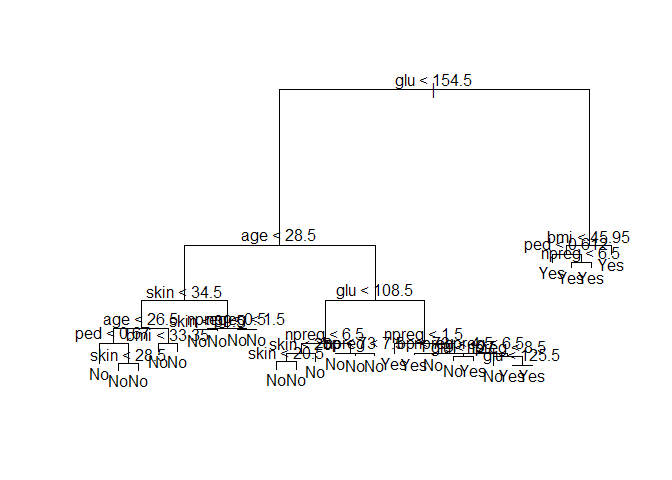<!-- -->

Η πρώτη μεταβλητή που εξετάζεται είναι η συγκέντρωση γλυκόζης (glu) και
ακολουθούν η ηλικία (age) και ο δείκτης βάρους σώματος (bmi).

``` r
summary(tree_model)
```

    ## 
    ## Classification tree:
    ## tree(formula = type ~ ., data = train, split = "gini")
    ## Number of terminal nodes:  27 
    ## Residual mean deviance:  0.6361 = 151.4 / 238 
    ## Misclassification error rate: 0.1472 = 39 / 265

``` r
preds<-predict(tree_model,newdata=test[,-8],type='class')
t<-table(Actual=test$type,Predicted=preds)
t
```

    ##       Predicted
    ## Actual No Yes
    ##    No  41   5
    ##    Yes 10  11

``` r
print(paste("Accuracy on test set: ",sum(diag(t))/sum(t)))
```

    ## [1] "Accuracy on test set:  0.776119402985075"

Όπως φαίνεται η ακρίβεια του μοντέλου στα δεδομένα ελέγχου είναι 77.61%

<b>Support Vector Machines</b>

Στη συνέχεια χρησιμοποιούμε Support Vector Machines για διάφορα kernels.
Για κάθε ένα εκτυπώνεται ο πίνακας σύγχυσης καθώς και η ακρίβεια του
μοντέλου στα δεδομένα ελέγχου.

<b>Linear Kernel</b>

``` r
svm_linear = svm(formula = type ~ .,data = train,type = 'C-classification',kernel = 'linear')
y_pred = predict(svm_linear, newdata = test[-8]) 
cm = table(test[, 8], y_pred) 
cm
```

    ##      y_pred
    ##       No Yes
    ##   No  41   5
    ##   Yes 10  11

``` r
print(paste("Accuracy on test set: ",sum(diag(cm))/sum(cm)))
```

    ## [1] "Accuracy on test set:  0.776119402985075"

<b>Radial Basis Function Kernel</b>

``` r
svm_rbf = svm(formula = type ~ .,data = train,type = 'C-classification',kernel = 'radial')
y_pred = predict(svm_rbf, newdata = test[-8]) 
cm = table(test[, 8], y_pred) 
cm
```

    ##      y_pred
    ##       No Yes
    ##   No  41   5
    ##   Yes 12   9

``` r
print(paste("Accuracy on test set: ",sum(diag(cm))/sum(cm)))
```

    ## [1] "Accuracy on test set:  0.746268656716418"

<b> Πολυώνυμο τρίτου βαθμού </b>

``` r
svm_poly3 = svm(formula = type ~ .,data = train,type = 'C-classification',kernel = 'polynomial')
y_pred = predict(svm_poly3, newdata = test[-8]) 
cm = table(test[, 8], y_pred) 
cm
```

    ##      y_pred
    ##       No Yes
    ##   No  45   1
    ##   Yes 12   9

``` r
print(paste("Accuracy on test set: ",sum(diag(cm))/sum(cm)))
```

    ## [1] "Accuracy on test set:  0.805970149253731"

<b> Πολυώνυμο δευτέρου βαθμού </b>

``` r
svm_poly2 = svm(formula = type ~ .,data = train,type = 'C-classification',kernel = 'polynomial',degree=2)
y_pred = predict(svm_poly2, newdata = test[-8]) 
cm = table(test[, 8], y_pred) 
cm
```

    ##      y_pred
    ##       No Yes
    ##   No  42   4
    ##   Yes 14   7

``` r
print(paste("Accuracy on test set: ",sum(diag(cm))/sum(cm)))
```

    ## [1] "Accuracy on test set:  0.73134328358209"

<b>Sigmoid Function</b>

``` r
svm_sigmoid = svm(formula = type ~ .,data = train,type = 'C-classification',kernel = 'sigmoid')
y_pred = predict(svm_sigmoid, newdata = test[-8]) 
cm = table(test[, 8], y_pred) 
cm
```

    ##      y_pred
    ##       No Yes
    ##   No  39   7
    ##   Yes 10  11

``` r
print(paste("Accuracy on test set: ",sum(diag(cm))/sum(cm)))
```

    ## [1] "Accuracy on test set:  0.746268656716418"

<b>Random Forests</b>

Παρακάτω χρησιμοποιούμε την ensemble μέθοδο Random Forests από τη
βιβλιοθήκη randomForest. Επιπλέον παραθέτουμε τη σημαντικότητα
των μεταβλητών (ως προς το Gini ). By default ο αλγόριθμος
χρησιμοποιεί 500 δένδρα.

``` r
rf <- randomForest(  type ~ .,data=train)
round(importance(rf), 2)
```

    ##       MeanDecreaseGini
    ## npreg            10.22
    ## glu              35.40
    ## bp                9.15
    ## skin             12.74
    ## bmi              16.99
    ## ped              16.70
    ## age              16.17

``` r
y_pred = predict(rf, newdata = test[-8]) 
cm = table(test[, 8], y_pred) 
cm
```

    ##      y_pred
    ##       No Yes
    ##   No  41   5
    ##   Yes  9  12

``` r
print(paste("Accuracy on test set: ",sum(diag(cm))/sum(cm)))
```

    ## [1] "Accuracy on test set:  0.791044776119403"

Καταλήγοντας, θα πρέπει να επισημάνουμε ότι καθότι εδώ έχουμε θέματα
υγείας, το σημαντικότερο είναι να μην καταγράψουμε έναν ασθενή ως
υγιή ενώ πάσχει από μια ασθένεια.Δηλαδή το Σφάλμα τύπου ΙΙ (false
negative). Με βάση αυτό το καλύτερο μοντέλο θα ήταν το Random Forest.

<b><u>Προβλέψεις</u></b>

Παρακάτω φαίνονται τα αποτελέσματα της εφαρμογής των μοντέλων για τα
δεδομένα της άσκησης:

<b>Λογιστική Παλινδρόμηση</b>

``` r
preds<-predict(log_regr,newdata=df,type='response')
preds
```

    ##          1          2          3          4 
    ## 0.94391293 0.03520135 0.37388583 0.66026410

<b>kΝΝ</b>

``` r
knn_model <- knn(data[,-8], df, data$type, k=7)
knn_model
```

    ## [1] No No No No
    ## Levels: No Yes

<b>Δένδρο απόφασης</b>

``` r
preds<-predict(tree_model,newdata=df,type='class')
preds
```

    ## [1] Yes No  No  No 
    ## Levels: No Yes

<b>SVM-Linear kernel</b>

``` r
preds<-predict(svm_linear,newdata=df,type='class')
preds
```

    ##   1   2   3   4 
    ## Yes  No  No Yes 
    ## Levels: No Yes

<b>SVM-RBF kernel</b>

``` r
preds<-predict(svm_rbf,newdata=df,type='class')
preds
```

    ##   1   2   3   4 
    ## Yes  No  No Yes 
    ## Levels: No Yes

<b>SVM-Polynomial Kernel (2nd degree)</b>

``` r
preds<-predict(svm_poly2,newdata=df,type='class')
preds
```

    ##   1   2   3   4 
    ## Yes Yes  No Yes 
    ## Levels: No Yes

<b>SVM-Polynomial Kernel (3rd degree)</b>

``` r
preds<-predict(svm_poly3,newdata=df,type='class')
preds
```

    ##   1   2   3   4 
    ## Yes  No  No Yes 
    ## Levels: No Yes

<b>SVM-Sigmoid Kernel (3rd degree)</b>

``` r
preds<-predict(svm_sigmoid,newdata=df,type='class')
preds
```

    ##   1   2   3   4 
    ## Yes  No  No  No 
    ## Levels: No Yes

<b>Random Forests</b>

``` r
preds<-predict(rf,newdata=df,type='class')
preds
```

    ##   1   2   3   4 
    ## Yes  No  No  No 
    ## Levels: No Yes

# Άσκηση 2

Θεωρούμε τα δεδομένα «decathlon». Τα δεδομένα αναφέρονται στις επιδόσεις
αγώνων δεκάθλου στους Ολυμπιακούς αγώνες της Αθήνας (23 έως 24 Αυγούστου
του 2004). Την πρώτη μέρα οι αθλητές αγωνίζονται σε 5 αγωνίσματα (100m,
long jump, shot put, high jump, 400m) και στα υπόλοιπα πέντε την δεύτερη
μέρα στα (110m hurdles, discus, pole vault, javelin, 1500m). Να
κατασκευαστεί ένα δενδρόγραμμα που να μας δείχνει τις εικόνες
των επιδόσεων τους. Θα κάνετε τυποποίηση των δεδομένων όπου κρίνετε
απαραίτητο και κλάδεμα του δενδρογράμματος. Τέλος να χαρακτηρίσετε
τις συστάδες που προκύπτουν. Θεωρούμε τα δεδομένα «decathlon». Τα
δεδομένα αναφέρονται στις επιδόσεις αγώνων δεκάθλου στους
Ολυμπιακούς αγώνες της Αθήνας (23 έως 24 Αυγούστου του 2004).
Την πρώτη μέρα οι αθλητές αγωνίζονται σε 5 αγωνίσματα (100m, long jump,
shot put, high jump, 400m) και στα υπόλοιπα πέντε την δεύτερη μέρα στα
(110m hurdles, discus, pole vault, javelin, 1500m). Θα κάνετε τυποποίηση
των δεδομένων όπου κρίνετε απαραίτητο και κλάδεμα του δενδρογράμματος.
Να κάνετε συσταδοποίηση με τη μέθοδο kmeans

``` r
data<-read.table("decathlon.csv",sep=";",header=T,row.names = 1)
head(data)
```

    ##           X100m Long.jump Shot.put High.jump X400m X110m.H Discus Pole.vault
    ## Sebrle    10.85      7.84    16.36      2.12 48.36   14.05  48.72        5.0
    ## Clay      10.44      7.96    15.23      2.06 49.19   14.13  50.11        4.9
    ## Karpov    10.50      7.81    15.93      2.09 46.81   13.97  51.65        4.6
    ## Macey     10.89      7.47    15.73      2.15 48.97   14.56  48.34        4.4
    ## Warners   10.62      7.74    14.48      1.97 47.97   14.01  43.73        4.9
    ## Zsivoczky 10.91      7.14    15.31      2.12 49.40   14.95  45.62        4.7
    ##           Javeline X1500m Rank Points Competition
    ## Sebrle       70.52 280.01    1   8893    OlympicG
    ## Clay         69.71 282.00    2   8820    OlympicG
    ## Karpov       55.54 278.11    3   8725    OlympicG
    ## Macey        58.46 265.42    4   8414    OlympicG
    ## Warners      55.39 278.05    5   8343    OlympicG
    ## Zsivoczky    63.45 269.54    6   8287    OlympicG

Τα δεδομένα αναφαίρονται σε δύο διαγωνισμούς, τους Ολυμπιακούς Αγώνες
και το Decastar. Αρχικά απομονώνουμε τα δεδομένα των Ολυμπιακών
Αγώνων και αφαιρούμε τη στήλη Competition και Rank. Επίσης
προσθέτουμε στα ονόματα των αθλητών την κατάταξή τους.

``` r
data_OG <- subset(data, Competition == "OlympicG")
data_OG$Competition <- NULL
data_OG$Rank <- NULL
rownames(data_OG) <- paste(1:28, rownames(data_OG))
head(data_OG)
```

    ##             X100m Long.jump Shot.put High.jump X400m X110m.H Discus Pole.vault
    ## 1 Sebrle    10.85      7.84    16.36      2.12 48.36   14.05  48.72        5.0
    ## 2 Clay      10.44      7.96    15.23      2.06 49.19   14.13  50.11        4.9
    ## 3 Karpov    10.50      7.81    15.93      2.09 46.81   13.97  51.65        4.6
    ## 4 Macey     10.89      7.47    15.73      2.15 48.97   14.56  48.34        4.4
    ## 5 Warners   10.62      7.74    14.48      1.97 47.97   14.01  43.73        4.9
    ## 6 Zsivoczky 10.91      7.14    15.31      2.12 49.40   14.95  45.62        4.7
    ##             Javeline X1500m Points
    ## 1 Sebrle       70.52 280.01   8893
    ## 2 Clay         69.71 282.00   8820
    ## 3 Karpov       55.54 278.11   8725
    ## 4 Macey        58.46 265.42   8414
    ## 5 Warners      55.39 278.05   8343
    ## 6 Zsivoczky    63.45 269.54   8287

Παρακάτω φαίνονται τα ιστογράμματα για κάθε άθλημα

``` r
p1<-ggplot(data=data_OG , aes(x= X100m))+geom_histogram(bins=20)
p2<-ggplot(data=data_OG , aes(x= Long.jump))+geom_histogram(bins=20)
p3<-ggplot(data=data_OG , aes(x= Shot.put))+geom_histogram(bins=20)
p4<-ggplot(data=data_OG , aes(x= High.jump))+geom_histogram(bins=20)
p5<-ggplot(data=data_OG , aes(x= X400m))+geom_histogram(bins=20)
p6<-ggplot(data=data_OG , aes(x= X110m.H))+geom_histogram(bins=20)
p7<-ggplot(data=data_OG , aes(x= Discus))+geom_histogram(bins=20)
p8<-ggplot(data=data_OG , aes(x= Pole.vault))+geom_histogram(bins=20)
p9<-ggplot(data=data_OG , aes(x= Javeline))+geom_histogram(bins=20)
p10<-ggplot(data=data_OG , aes(x= X1500m))+geom_histogram(bins=20)

grid.arrange(p1, p2,p3,p4,p5,p6,p7,p8,p9,p10, ncol=4)
```

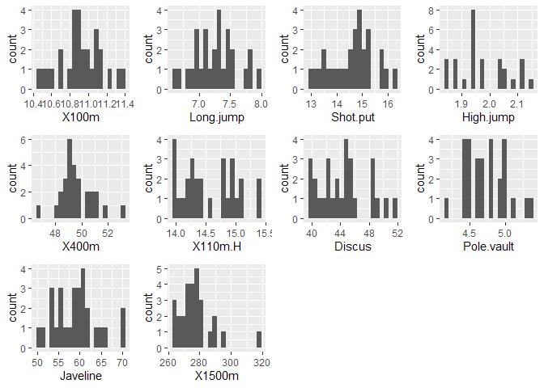<!-- -->

Στη συνέχεια θα κάνουμε τυποποίηση των δεδομένων. Eπιπλέον εισάγουμε ως
δεικτοδότηση τα ονόματα των αθλητών για να απεικονιστούν στα γραφήματα.

``` r
data_OG <- data.frame(Athlete = factor(row.names(data_OG),levels = row.names(data_OG)), data_OG)

data_OG_scaled<-as.data.frame(scale(data_OG[-1]))
data_OG_scaled <- data.frame(Athlete = factor(row.names(data_OG_scaled), levels = row.names(data_OG_scaled)), 
    data_OG_scaled)
head(data_OG_scaled)
```

    ##                 Athlete       X100m  Long.jump   Shot.put  High.jump      X400m
    ## 1 Sebrle       1 Sebrle -0.28444399  1.6834526  2.0263454  1.5961767 -0.9854509
    ## 2 Clay           2 Clay -2.05912717  2.0352188  0.7065931  0.9291178 -0.3311115
    ## 3 Karpov       3 Karpov -1.79941744  1.5955110  1.5241388  1.2626473 -2.2074100
    ## 4 Macey         4 Macey -0.11130417  0.5988401  1.2905543  1.9297062 -0.5045509
    ## 5 Warners     5 Warners -1.27999797  1.3903141 -0.1693488 -0.0714706 -1.2929116
    ## 6 Zsivoczky 6 Zsivoczky -0.02473426 -0.3685170  0.8000269  1.5961767 -0.1655558
    ##                 X110m.H     Discus Pole.vault    Javeline      X1500m    Points
    ## 1 Sebrle    -1.13751179  1.3166153  0.9256099  2.32544650  0.21721634 2.2585208
    ## 2 Clay      -0.95680070  1.7378802  0.5800488  2.16266022  0.39298303 2.0625861
    ## 3 Karpov    -1.31822289  2.2046054 -0.4566342 -0.68509481  0.04939889 1.8076027
    ## 4 Macey      0.01452143  1.2014493 -1.1477562 -0.09826032 -1.07144499 0.9728674
    ## 5 Warners   -1.22786734 -0.1956955  0.5800488 -0.71524042  0.04409940 0.7823008
    ## 6 Zsivoczky  0.89548801  0.3771036 -0.1110732  0.90458354 -0.70754611 0.6319947

<b>Ιεραρχική Συσταδοποίηση με τη μέθοδο Ward</b>

``` r
clust_ward <- hclust(d = dist(data_OG_scaled[2:11]), method = "ward.D")

plot(clust_ward, xlab = "", ylab = "", yaxt = "n", main = "Hierarchical Clustering Dendogram - Ward Method")
```

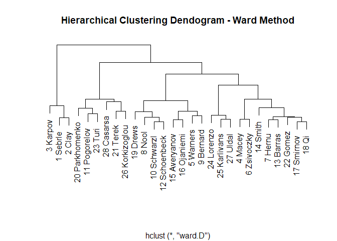<!-- -->

<b>Ιεραρχική Συσταδοποίηση με τη μέθοδο Average</b>

``` r
clust_avg <- hclust(d = dist(data_OG_scaled[2:11]), method = "average")

plot(clust_avg, xlab = "", ylab = "", yaxt = "n", main = "Hierarchical Clustering Dendogram - Average Method")
```

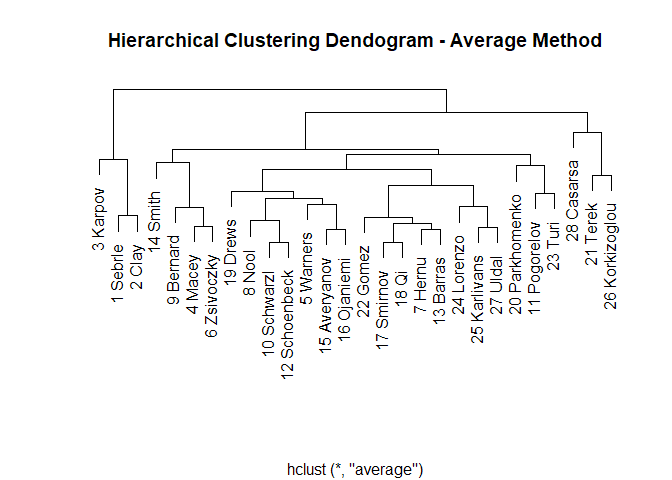<!-- -->

Για το κλάδεμα του δενδρογράμματος επιλέγουμε 3 clusters και τα
αποτελέσματα φαίνονται παρακάτω

``` r
clustered_croped<-cutree(clust_avg,k=3)
clustered_croped
```

    ##       1 Sebrle         2 Clay       3 Karpov        4 Macey      5 Warners 
    ##              1              1              1              2              2 
    ##    6 Zsivoczky        7 Hernu         8 Nool      9 Bernard    10 Schwarzl 
    ##              2              2              2              2              2 
    ##   11 Pogorelov  12 Schoenbeck      13 Barras       14 Smith   15 Averyanov 
    ##              2              2              2              2              2 
    ##    16 Ojaniemi     17 Smirnov          18 Qi       19 Drews 20 Parkhomenko 
    ##              2              2              2              2              2 
    ##       21 Terek       22 Gomez        23 Turi     24 Lorenzo   25 Karlivans 
    ##              3              2              2              2              2 
    ## 26 Korkizoglou       27 Uldal     28 Casarsa 
    ##              3              2              3

Οι συστάδες σχετίζονται με την συνολική απόδοση των αθλητών αλλά και με
τις επιμέρους αποδόσεις τους στα αθλήματα.Υπάρχουν αθλητές που είναι
καλύτεροι σε ορισμένες “κατηγορίες αθλημάτων”, όπως αθλήματα αντοχής
ή εκρηκτικότητα.

<b>Συσταδοποίηση με KMeans χρησιμοποιώντας 3 συστάδες </b>

``` r
kmeans<-kmeans(data_OG_scaled[2:11],centers=3,nstart=25)
kmeans
```

    ## K-means clustering with 3 clusters of sizes 13, 7, 8
    ## 
    ## Cluster means:
    ##         X100m  Long.jump   Shot.put  High.jump     X400m     X110m.H
    ## 1 -0.08799689  0.1591323 -0.4801958 -0.5845929 -0.357188 -0.07409651
    ## 2 -0.79149633  0.6909693  1.0386167  1.1673531 -0.691505 -0.65669121
    ## 3  0.83555423 -0.8631882 -0.1284715 -0.0714706  1.185497  0.69501164
    ##        Discus  Pole.vault    Javeline     X1500m
    ## 1 -0.59691133  0.20790622 -0.06270397 -0.5455717
    ## 2  1.19408908 -0.45663420  0.62666976 -0.2362693
    ## 3 -0.07484705  0.06170732 -0.44644209  1.0932896
    ## 
    ## Clustering vector:
    ##       1 Sebrle         2 Clay       3 Karpov        4 Macey      5 Warners 
    ##              2              2              2              2              1 
    ##    6 Zsivoczky        7 Hernu         8 Nool      9 Bernard    10 Schwarzl 
    ##              2              1              1              2              1 
    ##   11 Pogorelov  12 Schoenbeck      13 Barras       14 Smith   15 Averyanov 
    ##              3              1              1              2              1 
    ##    16 Ojaniemi     17 Smirnov          18 Qi       19 Drews 20 Parkhomenko 
    ##              1              1              1              1              3 
    ##       21 Terek       22 Gomez        23 Turi     24 Lorenzo   25 Karlivans 
    ##              3              1              3              1              3 
    ## 26 Korkizoglou       27 Uldal     28 Casarsa 
    ##              3              3              3 
    ## 
    ## Within cluster sum of squares by cluster:
    ## [1] 60.87064 47.52352 59.06912
    ##  (between_SS / total_SS =  38.0 %)
    ## 
    ## Available components:
    ## 
    ## [1] "cluster"      "centers"      "totss"        "withinss"     "tot.withinss"
    ## [6] "betweenss"    "size"         "iter"         "ifault"

Παρακάτω βλέπουμε τις μέσες τιμές για κάθε συστάδα και για κάθε άθλημα
αντίστοιχα.

``` r
aggregate(data_OG_scaled[2:11], by=list(cluster=kmeans$cluster), mean)
```

    ##   cluster       X100m  Long.jump   Shot.put  High.jump     X400m     X110m.H
    ## 1       1 -0.08799689  0.1591323 -0.4801958 -0.5845929 -0.357188 -0.07409651
    ## 2       2 -0.79149633  0.6909693  1.0386167  1.1673531 -0.691505 -0.65669121
    ## 3       3  0.83555423 -0.8631882 -0.1284715 -0.0714706  1.185497  0.69501164
    ##        Discus  Pole.vault    Javeline     X1500m
    ## 1 -0.59691133  0.20790622 -0.06270397 -0.5455717
    ## 2  1.19408908 -0.45663420  0.62666976 -0.2362693
    ## 3 -0.07484705  0.06170732 -0.44644209  1.0932896

Εδώ πρέπει να αναφαίρουμε ότι ο χρόνος που έκανε κάθε αθλητής στα
αθλήματα όσο λιγότερος είναι τόσο το καλύτερο. Δηλαδή θα πρέπει
να ερμηνέυσουμε τα αποτελέσματα με αντίθετα πρόσημα. Για παράδειγμα
στους μέσους όρους των συστάδων, οι αρνητικές τιμές σημαίνουν
λιγότερους χρόνους και άρα καλύτερη επίδοση.

Η ερμηνεία των συστάδων είναι αυτή που περιγράψαμε και για την Ιεραρχική
Συσταδοποίηση.

# Άσκηση 6

car\_sales.csv Εφαρμόστε παραγοντική ανάλυση με πλήρη ανάλυση προς κάθε
κατεύθυνση

Αρχικά διαβάζουμε τα δεδομένα από το αρχείο csv.

``` r
car_sales<-read.csv("car_sales.csv",header = T,sep = ";",dec = ",")
head(car_sales)
```

    ##   manufact   model  sales resale type price engine_s horsepow wheelbas width
    ## 1    Acura Integra 16.919 16.360    0 21.50      1.8      140    101.2  67.3
    ## 2    Acura      TL 39.384 19.875    0 28.40      3.2      225    108.1  70.3
    ## 3    Acura      CL 14.114 18.225    0    NA      3.2      225    106.9  70.6
    ## 4    Acura      RL  8.588 29.725    0 42.00      3.5      210    114.6  71.4
    ## 5     Audi      A4 20.397 22.255    0 23.99      1.8      150    102.6  68.2
    ## 6     Audi      A6 18.780 23.555    0 33.95      2.8      200    108.7  76.1
    ##   length curb_wgt fuel_cap mpg  lnsales     zresale      ztype      zprice
    ## 1  172.4    2.639     13.2  28 2.828437 -0.14956062 -0.5926188 -0.41045828
    ## 2  192.9    3.517     17.2  25 3.673360  0.15733558 -0.5926188  0.07032257
    ## 3  192.0    3.470     17.2  26 2.647167  0.01327335 -0.5926188          NA
    ## 4  196.6    3.850     18.0  22 2.150366  1.01734341 -0.5926188  1.01794859
    ## 5  178.0    2.998     16.4  27 3.015388  0.36513442 -0.5926188 -0.23695910
    ## 6  192.0    3.561     18.5  22 2.932792  0.47863799 -0.5926188  0.45703760
    ##     zengine_   zhorsepo    zwheelba      zwidth    zlength   zcurb_wg
    ## 1 -1.2070012 -0.8103784 -0.82278892 -1.11533688 -1.1125568 -1.1721235
    ## 2  0.1331567  0.6887312  0.08019843 -0.24624321  0.4136772  0.2204185
    ## 3  0.1331567  0.6887312 -0.07684285 -0.15933384  0.3466718  0.1458746
    ## 4  0.4203334  0.4241825  0.93083869  0.07242447  0.6891438  0.7485693
    ## 5 -1.2070012 -0.6340126 -0.63957410 -0.85460878 -0.6956344 -0.6027356
    ## 6 -0.2497456  0.2478166  0.15871907  1.43400456  0.3466718  0.2902042
    ##      zfuel_ca       zmpg
    ## 1 -1.22222719  0.9705266
    ## 2 -0.19339977  0.2700372
    ## 3 -0.19339977  0.5035336
    ## 4  0.01236571 -0.4304523
    ## 5 -0.39916525  0.7370301
    ## 6  0.14096914 -0.4304523

Μετατρέπουμε τη στήλη “type” σε τύπο factor.

``` r
car_sales$type <- car_sales$type %>% factor(labels = sort(unique(car_sales$type)))
```

Ανάλυση Τιμής (Price)

``` r
ggplot(data = car_sales, aes(x = engine_s, y = price)) +
  geom_point(na.rm=T) +
  xlab('Engine size') +
  ylab('Price') +
  ggtitle('Price vs Engine size')
```

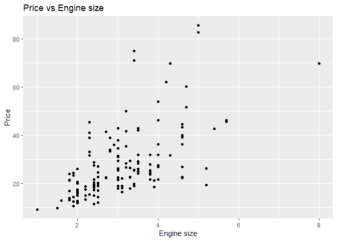<!-- -->

``` r
ggplot(data = car_sales, aes(x = horsepow, y = price)) +
  geom_point(na.rm=T) +
  xlab('Horsepower') +
  ylab('Price') +
  ggtitle('Price vs Horsepower')
```

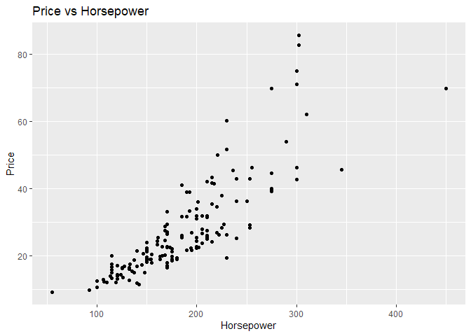<!-- -->

``` r
ggplot(data = car_sales, aes(x = fuel_cap, y = price)) +
  geom_point(na.rm=T) +
  xlab('Fuel Capacity') +
  ylab('Price') +
  ggtitle('Price vs Fuel Capacity')
```

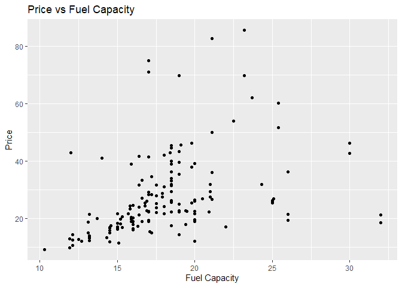<!-- -->

``` r
ggplot(data = car_sales, aes(x = mpg, y = price)) +
  geom_point(na.rm=T) +
  xlab('Miles per gallon') +
  ylab('Price') +
  ggtitle('Price vs MPG')
```

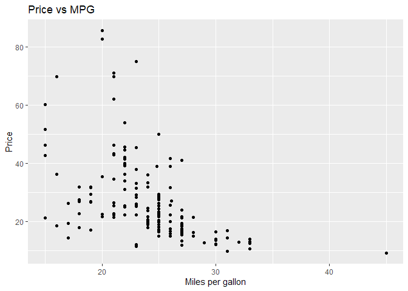<!-- -->

``` r
ggplot(data = car_sales, aes(x = type, y = price)) +
  geom_boxplot() +
  xlab('Type') +
  ylab('Price') +
  ggtitle('Price by Type')
```

    ## Warning: Removed 2 rows containing non-finite values (stat_boxplot).

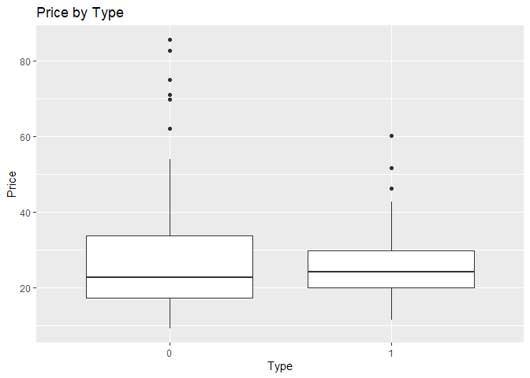<!-- -->

Στη συνέχεια υπολογίζουμε το συντελεστή συσχέτισης του Pearson για τα
αριθμητικά δεδομένα

``` r
numeric_sales<-na.omit(car_sales[, sapply(car_sales, is.numeric)])
```

``` r
ggcorrplot(cor(numeric_sales), method= "square",type= "lower",show.legend= TRUE,legend.title  = "Correlation",show.diag= TRUE,hc.order= TRUE,colors = c("blue", "white", "red"),title='Correlation of numeric features')
```

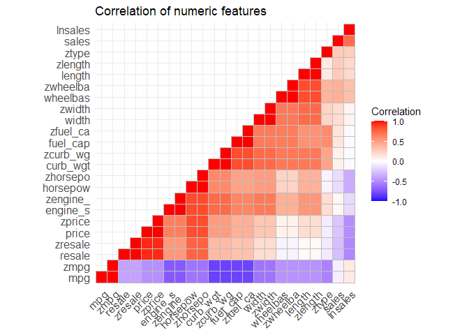<!-- -->

## Διερευνητική Παραγοντική Ανάλυση (Exploratory factor analysis)

Χρησιμοποιούμε το πακέτο psych και την εντολή fa.parallel για να
προσδιορίσουμε τον αριθμό των παραγόντων. Όπως φαίνεται
παρακάτω, ο συνιστόμενος αριθμός είναι 3 παράγοντες. Επιπλέον
εκτυπώνονται τα αποτελέσματα και γραφικά.

``` r
fa.parallel(numeric_sales, fm = 'minres', fa = 'fa')
```

    ## Warning in cor.smooth(R): Matrix was not positive definite, smoothing was done

    ## In smc, smcs < 0 were set to .0

    ## Warning in cor.smooth(R): Matrix was not positive definite, smoothing was done

    ## In smc, smcs < 0 were set to .0

    ## Warning in cor.smooth(R): Matrix was not positive definite, smoothing was done

    ## In smc, smcs < 0 were set to .0

    ## Warning in cor.smooth(r): Matrix was not positive definite, smoothing was done

    ## In factor.scores, the correlation matrix is singular, an approximation is used

    ## Warning in cor.smooth(r): Matrix was not positive definite, smoothing was done

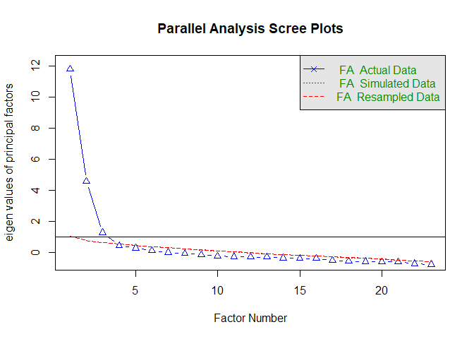<!-- -->

    ## Parallel analysis suggests that the number of factors =  3  and the number of components =  NA

## Επιβεβαιωτική Παραγοντική Ανάλυση (Confirmatory factor analysis)

Τώρα χρησιμοποιόυμε την εντολή fa() για να διεξάγουμε Ανάλυση Παραγόντων
με n=3. Για μέθοδο περιστρoφής των αξόνων χρησιμοποιούμε την oblimin που
επιτρέπει να υπάρχει συσχέτιση μεταξύ των παραγόντων. Τα αποτελέσματα
φαίνονται παρακάτω

``` r
factors<-fa(numeric_sales,nfactors = 3,fm="minres", rotate="oblimin")
```

    ## Warning in cor.smooth(R): Matrix was not positive definite, smoothing was done

    ## In smc, smcs < 0 were set to .0

    ## Warning in cor.smooth(R): Matrix was not positive definite, smoothing was done

    ## In smc, smcs < 0 were set to .0

    ## Warning in cor.smooth(R): Matrix was not positive definite, smoothing was done

    ## In smc, smcs < 0 were set to .0

    ## Warning in cor.smooth(r): Matrix was not positive definite, smoothing was done

    ## In factor.stats, I could not find the RMSEA upper bound . Sorry about that

    ## In factor.scores, the correlation matrix is singular, an approximation is used

    ## Warning in cor.smooth(r): Matrix was not positive definite, smoothing was done

``` r
print(factors)
```

    ## Factor Analysis using method =  minres
    ## Call: fa(r = numeric_sales, nfactors = 3, rotate = "oblimin", fm = "minres")
    ## Standardized loadings (pattern matrix) based upon correlation matrix
    ##            MR2   MR1   MR3   h2    u2 com
    ## sales    -0.42  0.36  0.12 0.27 0.729 2.1
    ## resale    0.95 -0.20  0.05 0.87 0.127 1.1
    ## price     0.96 -0.04  0.04 0.93 0.072 1.0
    ## engine_s  0.59  0.38  0.21 0.79 0.214 2.0
    ## horsepow  0.87  0.25 -0.01 0.91 0.088 1.2
    ## wheelbas -0.21  0.81  0.23 0.84 0.155 1.3
    ## width     0.16  0.71  0.17 0.75 0.254 1.2
    ## length    0.01  1.00 -0.08 0.93 0.075 1.0
    ## curb_wgt  0.26  0.39  0.56 0.89 0.110 2.2
    ## fuel_cap  0.13  0.21  0.76 0.88 0.124 1.2
    ## mpg      -0.28 -0.06 -0.77 0.86 0.141 1.3
    ## lnsales  -0.63  0.35  0.08 0.43 0.568 1.6
    ## zresale   0.95 -0.20  0.05 0.87 0.127 1.1
    ## ztype    -0.35 -0.21  0.95 0.71 0.292 1.4
    ## zprice    0.96 -0.04  0.04 0.93 0.072 1.0
    ## zengine_  0.59  0.38  0.21 0.79 0.214 2.0
    ## zhorsepo  0.87  0.25 -0.01 0.91 0.088 1.2
    ## zwheelba -0.21  0.81  0.23 0.84 0.155 1.3
    ## zwidth    0.16  0.71  0.17 0.75 0.254 1.2
    ## zlength   0.01  1.00 -0.08 0.93 0.075 1.0
    ## zcurb_wg  0.26  0.39  0.56 0.89 0.110 2.2
    ## zfuel_ca  0.13  0.21  0.76 0.88 0.124 1.2
    ## zmpg     -0.28 -0.06 -0.77 0.86 0.141 1.3
    ## 
    ##                        MR2  MR1  MR3
    ## SS loadings           7.33 6.26 5.10
    ## Proportion Var        0.32 0.27 0.22
    ## Cumulative Var        0.32 0.59 0.81
    ## Proportion Explained  0.39 0.33 0.27
    ## Cumulative Proportion 0.39 0.73 1.00
    ## 
    ##  With factor correlations of 
    ##      MR2  MR1  MR3
    ## MR2 1.00 0.22 0.30
    ## MR1 0.22 1.00 0.51
    ## MR3 0.30 0.51 1.00
    ## 
    ## Mean item complexity =  1.4
    ## Test of the hypothesis that 3 factors are sufficient.
    ## 
    ## The degrees of freedom for the null model are  253  and the objective function was  239.2 with Chi Square of  25714.4
    ## The degrees of freedom for the model are 187  and the objective function was  205.71 
    ## 
    ## The root mean square of the residuals (RMSR) is  0.05 
    ## The df corrected root mean square of the residuals is  0.06 
    ## 
    ## The harmonic number of observations is  117 with the empirical chi square  161.57  with prob <  0.91 
    ## The total number of observations was  117  with Likelihood Chi Square =  21702.22  with prob <  0 
    ## 
    ## Tucker Lewis Index of factoring reliability =  -0.165
    ## RMSEA index =  0.992  and the 90 % confidence intervals are  0.985 NA
    ## BIC =  20811.7
    ## Fit based upon off diagonal values = 0.99
    ## Measures of factor score adequacy             
    ##                                                    MR2  MR1  MR3
    ## Correlation of (regression) scores with factors   0.99 0.99 0.98
    ## Multiple R square of scores with factors          0.98 0.98 0.96
    ## Minimum correlation of possible factor scores     0.97 0.95 0.93

H ρίζα του μέσου τετραγώνου υπολείμματος (Root Mean Square Residual)
είναι ίση με 0.05 που είναι αρκετά μικρό ώστε να θεωρήσουμε
αξιόπιστη τη χρήση τριών παραγόντων.

Τα αποτελέσματα μπορούμε να τα δούμε και οπτικά με την εντολή
fa.diagram()

Εδώ φαίνεται πιο καθαρά η συσχέτιση που έχει κάθε παράγοντας με τις
επιμέρους μεταβλητέςκαθώς και μεταξύ τους.

``` r
fa.diagram(factors)
```

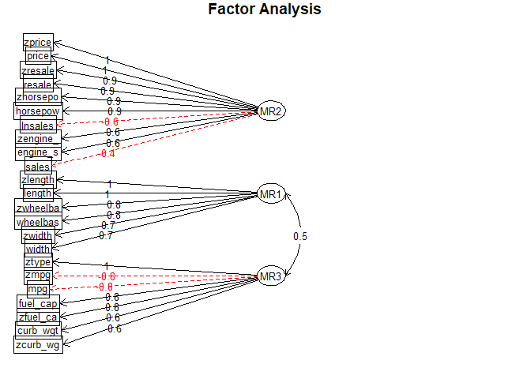<!-- -->

Επιλέγουμε να απεικονιστούν αυτές που με συσχέτιση από 0.7 και άνω.

``` r
fa.diagram(factors,cut=0.7)
```

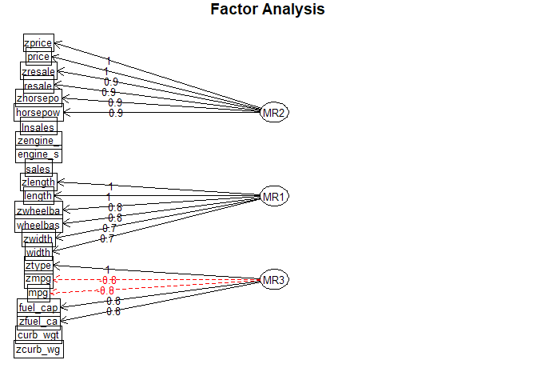<!-- -->

<b>Συμπεράσματα</b>

Όπως φαίνεται ο πρώτος παράγοντας (MR1) σχετίζεται κυρίως με τις
μεταβλητές ztype,mpg,zmpg,fuel\_cap και zfuel\_cap (κατανάλωση
καυσίμων, όγκος ντεπόζιτου).Ο δεύτερος με τις
zprice,price,resale,zhorsepower,horsepower (τιμή και ιπποδύναμη) και ο
τρίτος με τις zlength,length,zwheelbas,wheelbas (γεωμετρικά
χαρακτηριστικά αυτοκινήτου)
