Time Series Analysis
================
Evangelidakis Leandros

# Άσκηση 1

Τα στοιχεία του πίνακα παρουσιάζουν τις πωλήσεις μπύρας μίας βιομηχανίας
(σε εκατομμύρια μπουκάλια) ανά περιοχή από το 2016 μέχρι το 2019

``` r
years<-c(2016,2017,2018,2019)
data<-c(1,3,6,4,2,2,7,5,2,4,8,5,1,3,8,6)
matrix_data<-matrix(data,nrow=4,byrow=T)
beer_sales<-ts(data,start=c(2016,1),end=c(2019,4),frequency=4)
beer_sales
```

    ##      Qtr1 Qtr2 Qtr3 Qtr4
    ## 2016    1    3    6    4
    ## 2017    2    2    7    5
    ## 2018    2    4    8    5
    ## 2019    1    3    8    6

I.Να γίνει εξάλειψη της εποχικότητας και να υπολογιστούν οι εποχιακές
δείκτες αυτών των δεδομένων

II.Να κατασκευάσετε τη γραμμή τάσης

III.Να προσδιορίσετε την κυκλική μεταβολή με τη μέθοδο των σχετικών
κυκλικών καταλοίπων

## I

Αρχικά παρουσιάζουμε τη χρονοσειρά γραφικά.

``` r
tsplot(beer_sales, type="o", ylab="Millions of bottles",main="Beer sales")
```

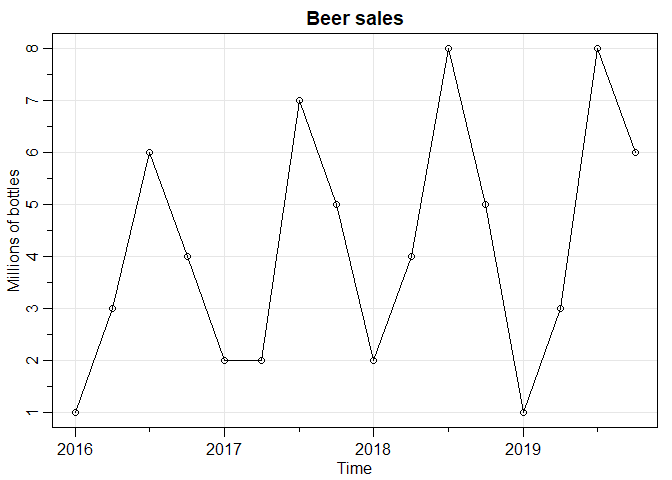<!-- -->

Όπως βλέπουμε, από χρόνο σε χρόνο, οι πωλήσεις έχουν αυξητική τάση μέχρι
τα μέσα περίπου της χρονιάς και μετά φθίνουσα μέχρι το τέλος.

Στη συνέχεια θα υπολογίσουμε τους εποχιακούς δείκτες.

Πρώτα υπολογίζουμε τον κινητό μέσο όρο 1ης τάξης 4 όρων (Moving average)
και τους μέσους όρους κάθε τριμήνου.

``` r
M<-ma(beer_sales,4)
matrix<-matrix(M,nrow=4,byrow=T)
M
```

    ##       Qtr1  Qtr2  Qtr3  Qtr4
    ## 2016    NA    NA 3.625 3.625
    ## 2017 3.625 3.875 4.000 4.250
    ## 2018 4.625 4.750 4.625 4.375
    ## 2019 4.250 4.375    NA    NA

Έπειτα υπολογίζουμε την ποσότητα \(K_i =(M_i + M_{i+1})/2\)

``` r
avg<-c()
matrix_M<-as.matrix(M)

for(i in 3:13){
  avg<-c(avg,(matrix_M[i]+matrix_M[i+1])/2)
}
avg
```

    ##  [1] 3.6250 3.6250 3.7500 3.9375 4.1250 4.4375 4.6875 4.6875 4.5000 4.3125
    ## [11] 4.3125

Και την ποσότητα \((Y_{i+2} / K_i)*100\)

``` r
org_data<-c(1,3,6,4,2,2,7,5,2,4,8,5,1,3,8,6)
z<-c()
for (i in 1:11){
    z<-c(z,(org_data[i+2]/avg[i])*100)

}
z
```

    ##  [1] 165.51724 110.34483  53.33333  50.79365 169.69697 112.67606  42.66667
    ##  [8]  85.33333 177.77778 115.94203  23.18841

``` r
z<-matrix(c(NA,NA,z,NA,NA,NA),nrow=4,byrow=T)
z
```

    ##          [,1]     [,2]     [,3]     [,4]
    ## [1,]       NA       NA 165.5172 110.3448
    ## [2,] 53.33333 50.79365 169.6970 112.6761
    ## [3,] 42.66667 85.33333 177.7778 115.9420
    ## [4,] 23.18841       NA       NA       NA

Μένει να υπολογίσουμε τους ποσοστιαίους μέσους όρους των εποχών.

Παρακάτω φαίνονται οι αδιόρθωτοι δείκτες και το άθροισμά τους

``` r
season_avg<-colMeans(z,na.rm = T)
season_avg
```

    ## [1]  39.72947  68.06349 170.99733 112.98764

``` r
s<-sum(season_avg)
s
```

    ## [1] 391.7779

Για τον υπολογισμό του διορθωτικού συντελεστή χρησιμοποιούμε τον τύπο
\(Διορθωτικός Συντελεστής = 400 / Άθροισμα Μέσων Όρων\)

``` r
adj<-400/s
adj
```

    ## [1] 1.020987

Οι τελικοί δείκτες εποχικότητας υπολογίζοντας διαιρώντας τις αδιόρθωτες
τιμές που πήραμε από τους μέσους όρους, με τον παραπάνω συντελεστή.

``` r
seasonal_indexes<-season_avg*adj
seasonal_indexes
```

    ## [1]  40.56325  69.49191 174.58598 115.35886

Επαλήθευση ότι το άθροισμά τους κάνει 400

``` r
sum(seasonal_indexes)
```

    ## [1] 400

Τώρα θα διαιρέσουμε κάθε καταχώρηση με τον αντίστοιχο εποχιακό δείκτη.

``` r
deseasoned_2016<-matrix_data[,1]/(seasonal_indexes[1]/100)
deseasoned_2017<-matrix_data[,2]/(seasonal_indexes[2]/100)
deseasoned_2018<-matrix_data[,3]/(seasonal_indexes[3]/100)
deseasoned_2019<-matrix_data[,4]/(seasonal_indexes[4]/100)
deseasoned_data<-matrix(cbind(deseasoned_2016,deseasoned_2017,deseasoned_2018,deseasoned_2019),nrow=4,byrow=F)
```

Μετά την εξάλειψη της εποχικότητας τα δεδομένα έχουν ως εξής:

``` r
deseasoned_data
```

    ##          [,1]     [,2]     [,3]     [,4]
    ## [1,] 2.465285 4.317049 3.436702 3.467441
    ## [2,] 4.930571 2.878033 4.009486 4.334301
    ## [3,] 4.930571 5.756066 4.582270 4.334301
    ## [4,] 2.465285 4.317049 4.582270 5.201161

``` r
deseasoned_data<-ts(array(t(deseasoned_data)),start=c(2016,1),end=c(2019,4),frequency=4)
deseasoned_data
```

    ##          Qtr1     Qtr2     Qtr3     Qtr4
    ## 2016 2.465285 4.317049 3.436702 3.467441
    ## 2017 4.930571 2.878033 4.009486 4.334301
    ## 2018 4.930571 5.756066 4.582270 4.334301
    ## 2019 2.465285 4.317049 4.582270 5.201161

Παρακάτω βλέπουμε τα νέα δεδομένα συγκριτικά με την αρχική χρονοσειρά.

``` r
ts.plot(beer_sales,deseasoned_data,type='o',main='Beer sales - Deseasonalized data',gpars = list(col=c('black','red')))
grid (lty = 1)
```

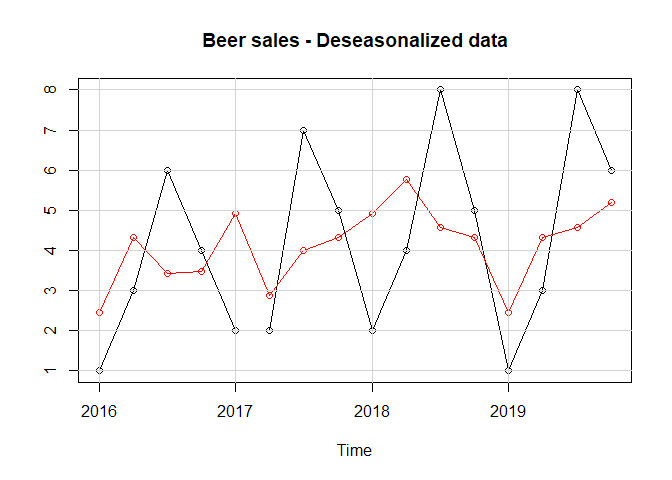<!-- -->

Και τα Deseasonalized δεδομένα ξεχωριστά

``` r
tsplot(deseasoned_data, type="o", ylab="Millions of bottles",main="Beer sales Deseasonalized",margins=1)
```

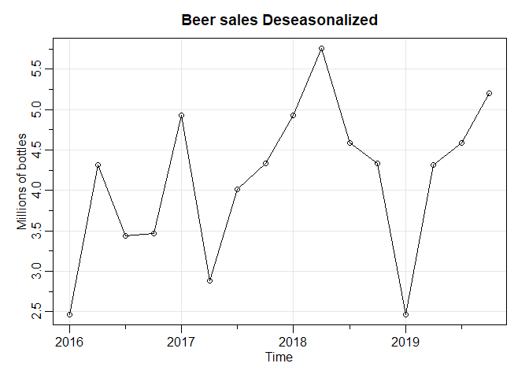<!-- -->

## II

Στη συνέχεια θα υπολογίσουμε την εξίσωσης της Τάσης

``` r
tsplot(deseasoned_data, type="o", ylab="Millions of bottles",main="Beer sales Deseasonalized",margins=1)
fit <- tslm(deseasoned_data ~ trend)
lines(fit$fitted.values,col='darkred')
fit
```

    ## 
    ## Call:
    ## tslm(formula = deseasoned_data ~ trend)
    ## 
    ## Coefficients:
    ## (Intercept)        trend  
    ##     3.43382      0.08137

``` r
text(2018,3.5,expression(y == 3.43382 + 0.08137*x),col='darkred')
```

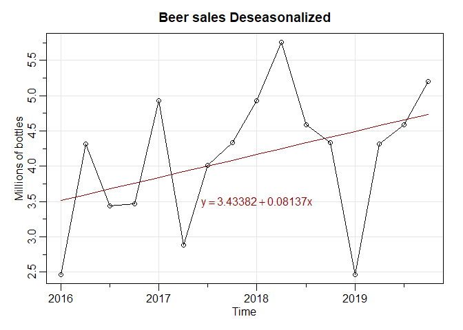<!-- -->

## II

Για την κυκλική μεταβολή υπολογίζουμε τα σχετικά κυκλικά κατάλοιπα από
τον τύπο: \(100 * (y- \hat y)/ \hat y\), όπου \(\hat y\) οι εκτιμήσεις
από την τάση.

``` r
cyclical<-100*((beer_sales-fit$fitted.values)/fit$fitted.values)
cyclical
```

    ##            Qtr1       Qtr2       Qtr3       Qtr4
    ## 2016 -71.552049 -16.587071  63.134893   6.402477
    ## 2017 -47.925944 -49.006353  74.850052  22.404910
    ## 2018 -51.994353  -5.828059  84.803480  13.371077
    ## 2019 -77.736561 -34.398156  71.879807  26.694850

``` r
tsplot(cyclical, main="Cyclical residuals",type="o",ylab=expression((y-hat(y) / hat(y)) * 100),margins=1)
grid (lty = 1)
lines(fit$fitted.values,col='darkred')
text(2017,16,'Trend line',col='darkred')
```

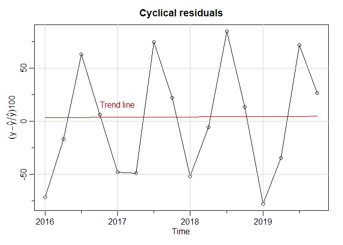<!-- -->

# Άσκηση 2

Στον επόμενο πίνακα δίνονται οι εισπράξεις από τις ετήσιες πωλήσεις (σε
χιλ.ευρώ) μία βιομηχανίας

``` r
income<-c(37.44,44.14,46.25,43.99,51.84,49.10,58.56,58.02,70.28)
yearly_income<-ts(income,start=2011,end=2019,frequency=1)
yearly_income
```

    ## Time Series:
    ## Start = 2011 
    ## End = 2019 
    ## Frequency = 1 
    ## [1] 37.44 44.14 46.25 43.99 51.84 49.10 58.56 58.02 70.28

I. Να γίνει εξάλειψη της εποχικότητας και να υπολογιστούν οι εποχιακές
δείκτες αυτών των δεδομένων

ΙΙ. Να κατασκευάσετε τη γραμμή τάσης

ΙΙΙ. Να προσδιορίσετε την κυκλική μεταβολή με τη μέθοδο των σχετικών
κυκλικών καταλοίπων

## I

Τα δεδομένα έχουν μόνο τις ετήσιες τιμές και συνεπώς μόνο η μακροχρόνια
τάση, η κυκλική μεταβολή και η ακανόνιστη μεταβολή λαμβάνονται υπόψη,
καθώς η εποχιακή μεταβολή κάνει ένα κύκλο στη διάρκεια του έτους.

Αρχικά παρουσιάζουμε γραφικά τη χρονοσειρά.

``` r
tsplot(yearly_income, type="o", ylab="Thousands of Euros",main="Yearly income")
```

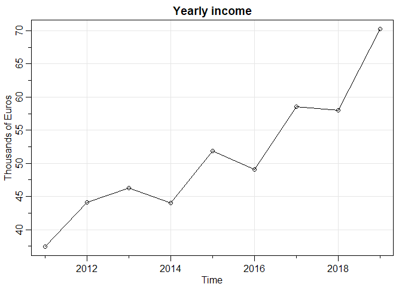<!-- -->

## II

Στη συνέχεια υπολογίζουμε την τάση

``` r
tsplot(yearly_income, type="o", ylab="Thousands of Euros",main="Yearly income")
fit <- tslm(yearly_income ~ trend)
lines(fit$fitted.values,col='darkred')
fit
```

    ## 
    ## Call:
    ## tslm(formula = yearly_income ~ trend)
    ## 
    ## Coefficients:
    ## (Intercept)        trend  
    ##      34.175        3.379

``` r
text(2015,55,expression(y == 34.175 + 3.379*x),col='darkred')
```

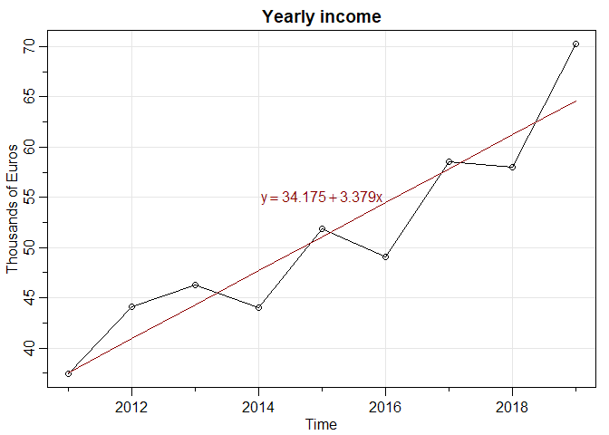<!-- -->

## III

Έπειτα υπολογίζουμε τα σχετικά κυκλικά κατάλοιπα από τον τύπο
\(100*(Y- \hat Y) / \hat Y\)

``` r
cyclical<-100*((yearly_income-fit$fitted.values)/fit$fitted.values)
cyclical
```

    ## Time Series:
    ## Start = 2011 
    ## End = 2019 
    ## Frequency = 1 
    ## [1] -0.302383  7.836364  4.375365 -7.758547  1.509943 -9.821756  1.268352
    ## [8] -5.204426  8.819147

``` r
tsplot(cyclical, main="Relative Cyclical residuals",type="o",ylab=expression((y-hat(y) / hat(y)) * 100),margins=1)
grid (lty = 1)
fit2 <- tslm(cyclical ~ trend)
lines(fit2$fitted.values,col='darkred')
fit
```

    ## 
    ## Call:
    ## tslm(formula = yearly_income ~ trend)
    ## 
    ## Coefficients:
    ## (Intercept)        trend  
    ##      34.175        3.379

``` r
text(2012.2,0,expression(y == 34.175 + 3.379*x),col='darkred')
```

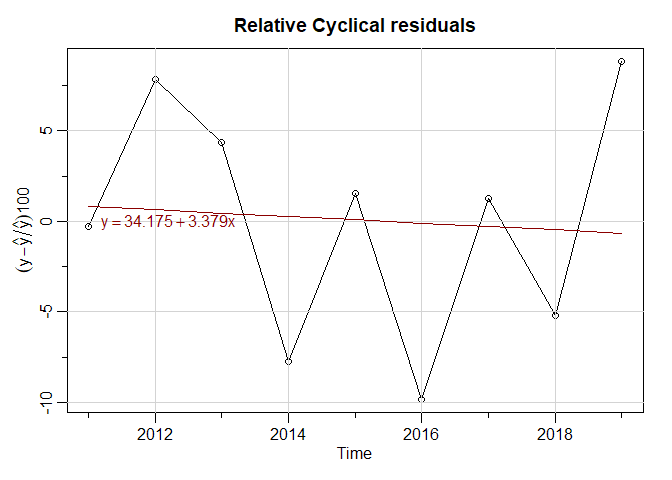<!-- -->

# Άσκηση 3

www.bankofcanada.ca the daily USD/CAD exchange rates for the last 2
years

I.Plot the time series

II.Βρείτε την ευθεία της τάσης με γραμμική παλινδρόμηση και κάντε το
κοινό γράφημα

III.Βρείτε quadratic trend και κάντε πάλι το γράφημα

IV.Υπολογίστε τις πρώτες και δεύτερες διαφορές και κάντε τα αντίστοιχα
γραφήματα

V.Κάντε μία πρόβλεψη με ένα από τα παραπάνω μοντέλα (4) για τις επόμενες
22 μέρες.

VI.Προσθέστε μία εποχική συνιστώσα (π.χ. την επίδραση του Ιανουαρίου)
στην γραμμική τάση (φτιάξτε μία binary μεταβλητή που θα δείχνει αν το
exchange rate είναι από το Γενάρη ή όχι) Κάντε fit το μοντέλο με την
επίδραση του Γενάρη.(hint : χρησιμοποιείστε τη συνάρτηση format to
convert the dates to strings)

VII.Κάνετε fit a quadratic trend θεωρώντας και την επίδραση του Γενάρη

VIII.Κανετε το γράφημα διασποράς μεταξύ των τιμών exchange rates and the
lagged values

IX.Υπολογίστε την αυτοσυσχέτιση r\_1 υστέρησης 1. Τι παρατηρείτε?

X.Φτιάξτε μια συνάρτηση (ονομάστε την cal AC(y,k) που θα υπολογίζει την
αυτοσυσχέτιση υστέρισης k γενικά για μία χρονοσειρά

XI.Στα παραπάνω δεδομένα φτιάξτε το ΑR(1) και MA(1) μοντέλο

ΑR(1)=ARIMA(1,0,0)

MA(1)=ARIMA(0,0,1)

XII.Συγκρίνετε τα παραπάνω δύο μοντέλα με το ARIMA(2,1,2).Υπολογίστε τα
ΜΑΕ (MEAN ABSOLUTE ERROR), mse, mape

## Ι

Αρχικά κατεβάζουμε τα δεδομένα σε αρχείο csv από την ιστοσελίδα που μας
δίνεται. Έπειτα, καθότι το αρχείο περιέχει περιττές πληροφορίες στις
πρώτες γραμμές του, τις αφαιρούμε χειροκίνητα και κρατάμε μόνο τα
δεδομένα. Επίσης η R διαβάζει λάθος την πρώτη τιμή γιαυτό την
αντικαθιστούμε με την σωστή, όπως φαίνεται παρακάτω.

``` r
data <- read.csv("FXUSDCAD-2016-12-30-ed-2019-01-01.csv",header=F,stringsAsFactors = F )
data[1,1]<-"03-01-17"
data$V1<-as.Date(format(as.Date(data$V1,"%d-%m-%y")),"20%y-%m-%d")
head(data)
```

    ##           V1     V2
    ## 1 2017-01-03 1.3435
    ## 2 2017-01-04 1.3315
    ## 3 2017-01-05 1.3244
    ## 4 2017-01-06 1.3214
    ## 5 2017-01-09 1.3240
    ## 6 2017-01-10 1.3213

Έπειτα μετατρέπουμε τη χρονοσειρά σε Time - Series αντικείμενο
χρησιμοποιώντας τη βιβλιοθήκη zoo αλλά και τη βιβλιοθήκη
tsbox.

``` r
ts_data_1 <- read.zoo(data)
ts_data_2<-ts_ts(ts_data.table(data))
```

    ## [time]: 'V1' [value]: 'V2' 
    ## [time]: 'V1' [value]: 'V2'

``` r
tsplot(ts_data_2,main='Daily Exchange rate',ylab='')
```

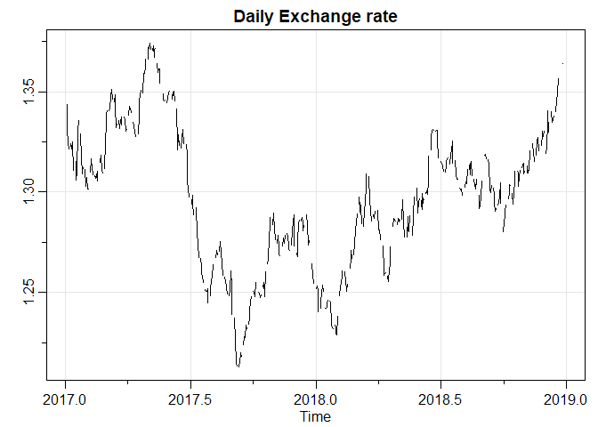<!-- -->

## ΙΙ

Για την τάση χρησιμοποιούμε τη βιλιοθήκη forecast και συγκεκριμένα την
εντολή tslm()

Γραμμική παλινδρόμηση για υπολογισμό της Τάσης :

``` r
tsplot(ts_data_2,main='USD Daily Exchange rate, Linear Trend',ylab='')
fit <- tslm(ts_data_2 ~ trend)
lines(fit$fitted.values,col='darkred')
fit
```

    ## 
    ## Call:
    ## tslm(formula = ts_data_2 ~ trend)
    ## 
    ## Coefficients:
    ## (Intercept)        trend  
    ##   1.3012540   -0.0000113

``` r
text(2017.8,1.31,expression(y == 1.3012540 -0.0000113*x),col='darkred')
```

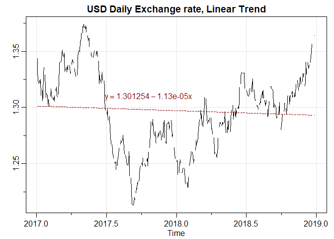<!-- -->

Η ευθεία της Τάσης είναι \(y=1.301254-0.0000113x\)

## ΙΙΙ

Στη συνέχεια κάνουμε πολυωνυμική παλινδρόμηση

``` r
tsplot(ts_data_2,main='Daily Exchange rate, Quadratic Trend',ylab='')
fit2 <- tslm(ts_data_2 ~ poly(trend,2))
lines(fit2$fitted.values,col='darkred')
fit2
```

    ## 
    ## Call:
    ## tslm(formula = ts_data_2 ~ poly(trend, 2))
    ## 
    ## Coefficients:
    ##     (Intercept)  poly(trend, 2)1  poly(trend, 2)2  
    ##         1.29711         -0.04896          0.64460

``` r
text(2018,1.32,expression(y == 1.29711 -0.04896*x +0.64460*x^2),col='darkred')
```

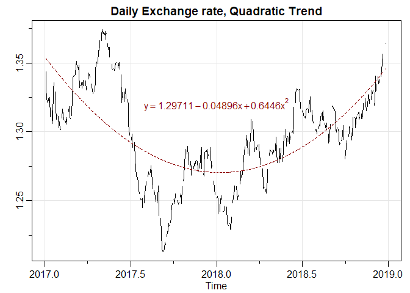<!-- -->

H εξίσωση του πολυωνύμου είναι η \(y= 1.29711-0.04896x+0.64460x^2\)

## ΙV

Υπολογισμός πρώτων και δεύτερων διαφορών χρησιμοποιώντας την εντολή
lag() του πακέτου stats

<b>Πρώτες Διαφορές</b>

``` r
first_dif<-ts_diff(ts_data_2)
sec_dif<-ts_diff(first_dif)
ts_plot(first_dif,title = "First Differences")
```

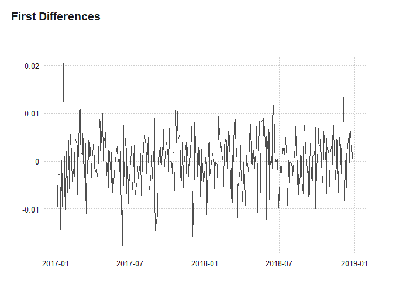<!-- -->

``` r
head(first_dif)
```

    ## Time Series:
    ## Start = 2017.00547581401 
    ## End = 2017.01916534905 
    ## Frequency = 365.2425 
    ## [1]      NA -0.0120 -0.0071 -0.0030      NA      NA

<b>Δεύτερες Διαφορές</b>

``` r
ts_plot(sec_dif,title = "Second Differences")
```

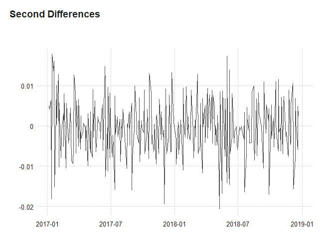<!-- -->

``` r
head(sec_dif)
```

    ## Time Series:
    ## Start = 2017.00547581401 
    ## End = 2017.01916534905 
    ## Frequency = 365.2425 
    ## [1]     NA     NA 0.0049 0.0041     NA     NA

<b>Πρώτες και Δεύτερες Διαφορές</b>

``` r
ts_plot(first_dif,sec_dif,title='First and Second Differences')
```

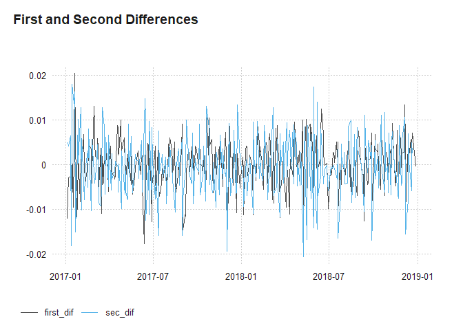<!-- -->

## V

Για την πρόβλεψη θα χρησιμοποιήσουμε το πολυωνυμικό μοντέλο και το
πακέτο forecast() με το οποίο κάνουμε τις προβλέψεις που φαίνονται
στο παρακάτω γράφημα.Η μέθοδος υπολογίζει αυτόματα και διαστήματα
εμπιστοσύνης 95% και 80%.

<b>Προβέψεις</b>

``` r
forecast(fit2, h=22)
```

    ##           Point Forecast    Lo 80    Hi 80    Lo 95    Hi 95
    ## 2018.9987       1.347601 1.314064 1.381137 1.296254 1.398947
    ## 2019.0014       1.348034 1.314494 1.381573 1.296682 1.399385
    ## 2019.0041       1.348468 1.314925 1.382011 1.297111 1.399825
    ## 2019.0069       1.348903 1.315356 1.382450 1.297541 1.400265
    ## 2019.0096       1.349340 1.315789 1.382890 1.297972 1.400707
    ## 2019.0124       1.349777 1.316224 1.383331 1.298404 1.401150
    ## 2019.0151       1.350216 1.316659 1.383773 1.298838 1.401594
    ## 2019.0178       1.350656 1.317096 1.384217 1.299273 1.402040
    ## 2019.0206       1.351098 1.317533 1.384662 1.299708 1.402487
    ## 2019.0233       1.351540 1.317972 1.385108 1.300145 1.402935
    ## 2019.0261       1.351984 1.318412 1.385555 1.300583 1.403384
    ## 2019.0288       1.352429 1.318853 1.386004 1.301023 1.403835
    ## 2019.0315       1.352875 1.319296 1.386454 1.301463 1.404287
    ## 2019.0343       1.353322 1.319739 1.386905 1.301905 1.404740
    ## 2019.0370       1.353771 1.320184 1.387358 1.302347 1.405194
    ## 2019.0397       1.354221 1.320630 1.387811 1.302791 1.405650
    ## 2019.0425       1.354672 1.321077 1.388266 1.303236 1.406107
    ## 2019.0452       1.355124 1.321526 1.388722 1.303683 1.406565
    ## 2019.0480       1.355577 1.321975 1.389180 1.304130 1.407025
    ## 2019.0507       1.356032 1.322426 1.389638 1.304579 1.407485
    ## 2019.0534       1.356488 1.322878 1.390098 1.305028 1.407947
    ## 2019.0562       1.356945 1.323331 1.390559 1.305479 1.408411

<b>Γραφική Απεικόνιση</b>

``` r
plot(forecast(fit2, h=22),main="Forecasts from Quadratic model",xlab="Time",ylab="Exchange Rate")
```

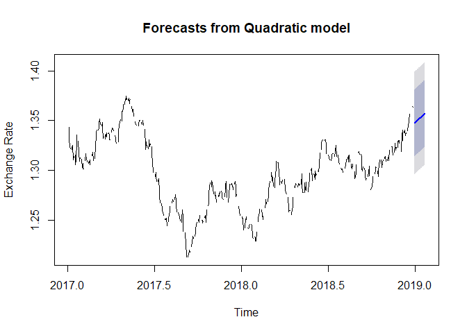<!-- -->

## VI

Εδώ μας ζητείται να προσθέσουμε ως εποχική συνιστώσα την επίδραση του
Ιανουαρίου.

Αρχικά αντιστοιχούμε με κάθε ημερομηνία την τιμές 0 και 1 ανάλογα αν
αυτή αντιστοιχεί στον Ιανουάριο.

``` r
jan<-replicate(length(data$V1), 0)
for (i in 1:length(jan)) {
  if (format(data$V1[i], "%m")=="01"){
    jan[i]<-c(1)
  }
}
```

## VII

Στο παρακάτω γράφημα φαίνεται η νέα καμπύλη με την επίδραση του
Ιανουαρίου.Η εξίσωσή της είναι
\[ y = 1.29999 -0.10153x +0.55641x^2 -0.03286j, j \in {0,1} \]

Επιπλέον παρουσιάζουμε και την αρχική πολυωνυμική καμπύλη που είχαμε
υπολογίσει σε προηγούμενο ερώτημα για σύγκριση των δύο μοντέλων.

``` r
par(mar = c(5, 5, 5, 5))
plot(data$V1,data$V2,type='l',main='Daily Exchange Rate \n Quadratic Trend with seasonal index of January',xlab='Date',ylab='')
fit<-lm( V2 ~ poly(V1,2) + jan, data=data)
fit
```

    ## 
    ## Call:
    ## lm(formula = V2 ~ poly(V1, 2) + jan, data = data)
    ## 
    ## Coefficients:
    ##  (Intercept)  poly(V1, 2)1  poly(V1, 2)2           jan  
    ##      1.29999      -0.10153       0.55641      -0.03286

``` r
lines(data$V1,fit$fitted.values,col='red',type='l')
text(data$V1[300],data$V2[80],expression(y == 1.29999 -0.10153*x +0.55641*x^2 -0.03286*j),col='darkred')
grid()
```

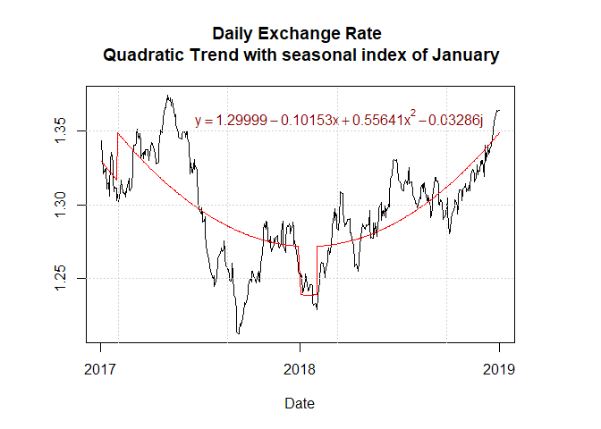<!-- -->

    ## 
    ## Call:
    ## tslm(formula = ts_data_2 ~ poly(trend, 2))
    ## 
    ## Coefficients:
    ##     (Intercept)  poly(trend, 2)1  poly(trend, 2)2  
    ##         1.29711         -0.04896          0.64460

<!-- -->

## VIII

Στα παρακάτω γραφήματα φαίνονται η αρχική χρονοσειρά και τα δεδομένα με
υστέρηση μίας και δύο ημερών.

<b>Υστέρηση μίας ημέρας</b>

``` r
ts_plot(ts_data_1,lag(ts_data_1,1), title='Original Data and Lagged(1 day)')
```

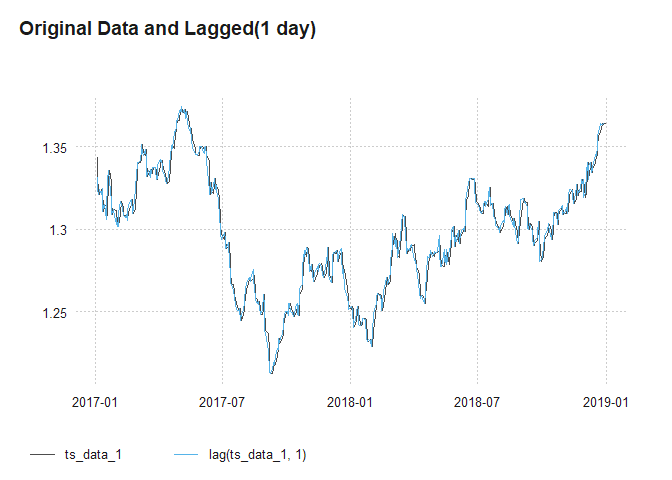<!-- -->

<b>Υστέρηση δύο ημερών</b>

``` r
ts_plot(ts_data_1,lag(ts_data_1,2), title='Original Data and Lagged(2 days)')
```

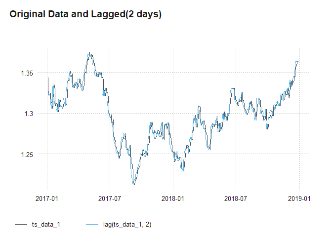<!-- -->

## IX

Για τον συντελεστή αυτοσυσχέτισης, υπολογίζουμε το lag για 1 ημέρα και
στη συνέχεια το συντελεστή συσχέτισης της χρονοσειράς με το lag.
Αππορίπτουμε της NA τιμές που προκύπτουν.

``` r
lag1 <- lag(ts_data_1, 1, na.pad=T)
acf_1<-cor(ts_data_1[!is.na(lag1)], lag1[!is.na(lag1)])
```

Έτσι ο συντελεστής αυτοσυσχέτισης είναι:

``` r
acf_1
```

    ## [1] 0.9891944

Παρατηρούμε ότι υπάρχει μεγάλη συσχέτιση (98.92%) μεταξύ των δεδομένων
και αυτών της προηγούμενης ημέρας.

## Χ

Φτιάχνουμε μια συνάρτηση που δέχεται ως είσοδο μια χρονοσειρά και ένα
ακέραιο και επιστρέφει την αυτοσυσχέτιση με υστερήσεις από 1 έως k.

``` r
acf_k<-c()
AC<-function(y,k){
  for(i in 1:k){
    lag_k <- lag(y, i, na.pad=T)
    acf_k<-c(acf_k,cor(y[!is.na(lag_k)], lag_k[!is.na(lag_k)]))
  }
acf_k
}
```

Εφαρμόζοντας τη συνάρτηση στα δεδομένα για k=5 έχουμε:

``` r
AC(ts_data_1,5)
```

    ## [1] 0.9891944 0.9742468 0.9595993 0.9450263 0.9308183

Βλέπουμε ότι η μεγαλύτερη συσχέτιση παρουσιάζεται για τα δεδομένα της
προηγούμενης ημέρας,ενώ μειώνεται γραμμικά με την αύξηση του k

## ΧΙ

Για τα μοντέλα ARIMA χρησιμοποιούμε το πακέτο forecast

<b>ARIMA(1,0,0)</b>

``` r
fit1 <- Arima(ts_data_1, order=c(1,0,0))
fit1
```

    ## Series: ts_data_1 
    ## ARIMA(1,0,0) with non-zero mean 
    ## 
    ## Coefficients:
    ##          ar1    mean
    ##       0.9921  1.3108
    ## s.e.  0.0046  0.0205
    ## 
    ## sigma^2 estimated as 2.391e-05:  log likelihood=1886.41
    ## AIC=-3766.82   AICc=-3766.78   BIC=-3753.05

``` r
checkresiduals(fit)
```

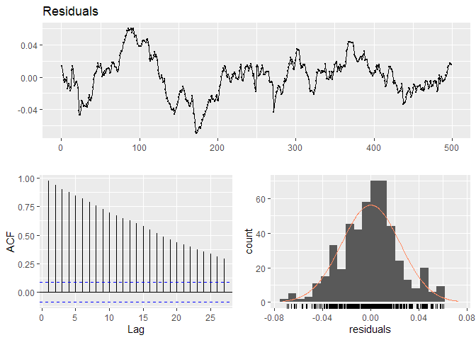<!-- -->

    ## 
    ##  Breusch-Godfrey test for serial correlation of order up to 10
    ## 
    ## data:  Residuals
    ## LM test = 472.87, df = 10, p-value < 2.2e-16

<b>ARIMA(2,0,0)</b>

``` r
fit2 <- Arima(ts_data_1, order=c(0,0,1))
fit2
```

    ## Series: ts_data_1 
    ## ARIMA(0,0,1) with non-zero mean 
    ## 
    ## Coefficients:
    ##          ma1    mean
    ##       1.0000  1.2972
    ## s.e.  0.0565  0.0016
    ## 
    ## sigma^2 estimated as 0.0003841:  log likelihood=1163.48
    ## AIC=-2320.96   AICc=-2320.93   BIC=-2307.19

``` r
checkresiduals(fit2)
```

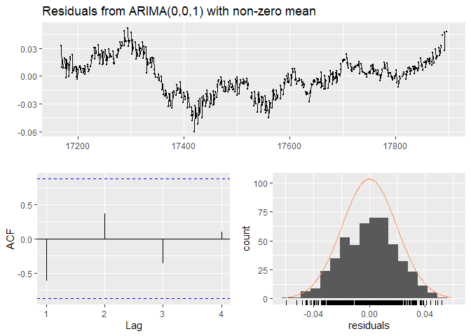<!-- -->

    ## 
    ##  Ljung-Box test
    ## 
    ## data:  Residuals from ARIMA(0,0,1) with non-zero mean
    ## Q* = 5888.5, df = 8, p-value < 2.2e-16
    ## 
    ## Model df: 2.   Total lags used: 10

## ΧΙΙ

<b>ARIMA(2,1,2)</b>

``` r
fit3 <- Arima(ts_data_1, order=c(2,1,2))
fit3
```

    ## Series: ts_data_1 
    ## ARIMA(2,1,2) 
    ## 
    ## Coefficients:
    ##           ar1      ar2     ma1     ma2
    ##       -0.7392  -0.1522  0.8390  0.0733
    ## s.e.   0.9298   0.6788  0.9432  0.7730
    ## 
    ## sigma^2 estimated as 2.299e-05:  log likelihood=1886.73
    ## AIC=-3763.45   AICc=-3763.37   BIC=-3740.51

``` r
checkresiduals(fit3)
```

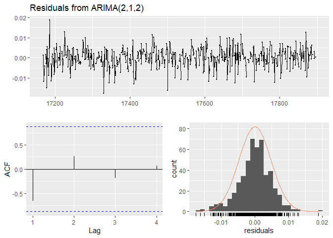<!-- -->

    ## 
    ##  Ljung-Box test
    ## 
    ## data:  Residuals from ARIMA(2,1,2)
    ## Q* = 125.69, df = 6, p-value < 2.2e-16
    ## 
    ## Model df: 4.   Total lags used: 10

Οι δείκτες <u>AIC</u> έχουν ως εξής:

<b> Arima(1,0,0): -3766.82 <br> Arima(0,0,1): -2320.96 <br>
Arima(2,1,2): -3763.45 <br> </b>

Όπως φαίνεται το πρώτο μοντέλο έχει λίγο μικρότερο AIC από το τρίτο ενώ
το δεύτερο αρκετά μεγαλύτερο.

Παρακάτω φαίνονται τα MAE,MSE,MAPE για κάθε μοντέλο:

``` r
print('Arima(1,0,0)')
```

    ## [1] "Arima(1,0,0)"

``` r
accuracy(fit1)
```

    ##                         ME        RMSE         MAE          MPE      MAPE
    ## Training set -9.037532e-05 0.004879724 0.003671265 -0.008602655 0.2832972
    ##                   MASE      ACF1
    ## Training set 0.8814805 0.1794574

``` r
print('Arima(0,0,1)')
```

    ## [1] "Arima(0,0,1)"

``` r
accuracy(fit2)
```

    ##                        ME       RMSE        MAE         MPE     MAPE     MASE
    ## Training set 1.838871e-06 0.01955999 0.01580404 -0.03995673 1.221188 3.794593
    ##                   ACF1
    ## Training set 0.8047555

``` r
print('Arima(2,1,2)')
```

    ## [1] "Arima(2,1,2)"

``` r
accuracy(fit3)
```

    ##                        ME        RMSE         MAE        MPE      MAPE     MASE
    ## Training set 2.526218e-05 0.004770356 0.003605562 0.00102651 0.2782423 0.865705
    ##                   ACF1
    ## Training set 0.1327798

<u>Mean Absolute Error (MAE):</u>

``` r
mae1<-accuracy(fit1)[3]
mae2<-accuracy(fit2)[3]
mae3<-accuracy(fit3)[3]
barplot(c(mae3,mae1,mae2),width = 1,main="Mean Absolute Error",names.arg = c("Arima(2,1,2)","Arima(1,0,0)","Arima(0,0,1)"))
```

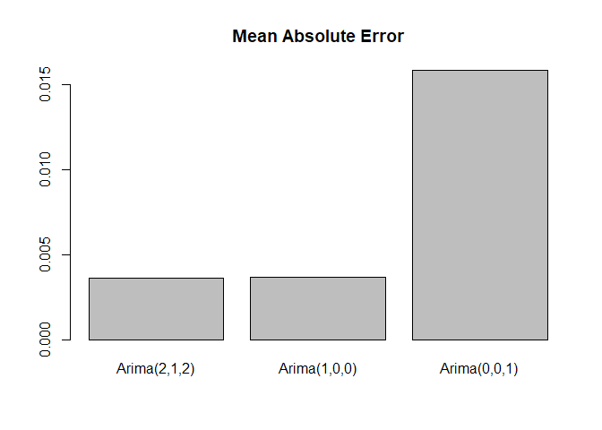<!-- -->

<u>Mean Squared Error (MSE):</u>

``` r
mse1<-accuracy(fit1)[2]^2
mse2<-accuracy(fit2)[2]^2
mse3<-accuracy(fit3)[2]^2
barplot(c(mse3,mse1,mse2),width = 1,main="Mean Squared Error",names.arg = c("Arima(2,1,2)","Arima(1,0,0)","Arima(0,0,1)"))
```

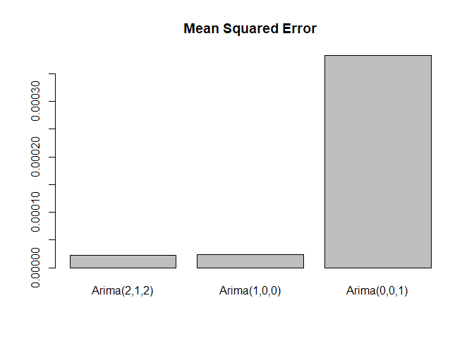<!-- -->

Το πρώτο μοντέλο έχει λίγο μεγαλύτερο MSE από το τρίτο ενώ το δεύτερο
πολύ μικρότερο.

<u>Mean Absolute Percentage Error (MAPE):</u>

Το πρώτο μοντέλο έχει λίγο μεγαλύτερο MAPE από το τρίτο ενώ το δεύτερο
αρκετά μεγαλύτερο.

``` r
mape1<-accuracy(fit1)[5]
mape2<-accuracy(fit2)[5]
mape3<-accuracy(fit3)[5]
barplot(c(mape3,mape1,mape2),width = 1,main="Mean Absolute Percentage Error",names.arg = c("Arima(2,1,2)","Arima(1,0,0)","Arima(0,0,1)"))
```

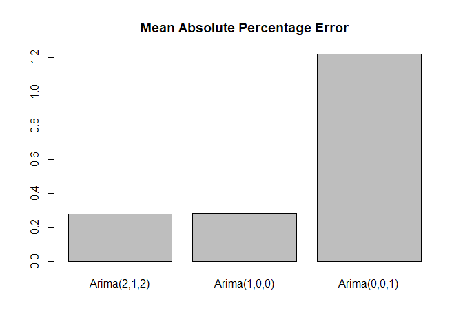<!-- -->
